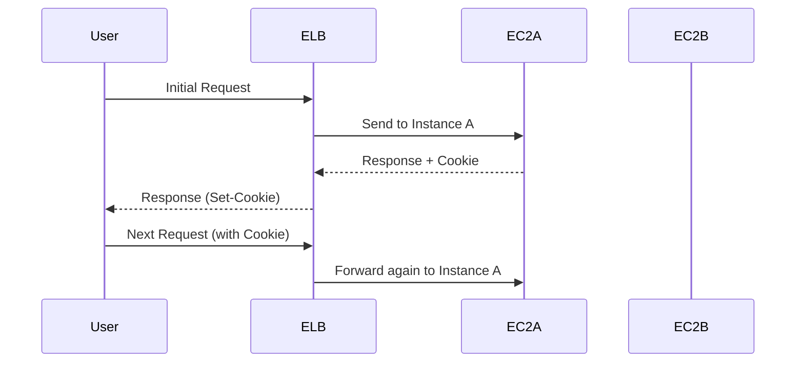

# RDS_Aurora_&_ElastiCache

```mermaid
sequenceDiagram
    participant User
    participant ELB
    participant EC2A
    participant EC2B

    User->>ELB: Initial Request
    ELB->>EC2A: Send to Instance A
    EC2A-->>ELB: Response + Cookie
    ELB-->>User: Response (Set-Cookie)
    User->>ELB: Next Request (with Cookie)
    ELB->>EC2A: Forward again to Instance A
```