Here’s an **enhanced, structured version** of your notes on **Amazon RDS, Aurora, & ElastiCache**, with **clear sections**, **extra explanations**, and **Mermaid diagrams** to visualize key concepts.

---

# ☁️ RDS, Aurora, & ElastiCache

---

## 🧩 Amazon RDS Overview

* **RDS** = Relational Database Service
* Managed AWS service for databases using **SQL** as a query language.
* Lets you create fully-managed cloud databases.

### ✅ Supported Database Engines

* PostgreSQL
* MySQL
* MariaDB
* Oracle
* Microsoft SQL Server
* IBM DB2
* **Amazon Aurora** (AWS Proprietary, MySQL & PostgreSQL compatible)

---

## ⚙️ Why Use RDS Instead of DB on EC2

### 🏗️ RDS is a Managed Service

* Automated provisioning & **OS patching**
* **Continuous backups** with **Point-in-Time Restore**
* **Monitoring dashboards**
* **Read Replicas** for read scalability
* **Multi-AZ setup** for disaster recovery
* **Maintenance windows** for version upgrades
* **Automatic scaling** (storage & compute)
* **EBS-backed storage**
* ❌ **No SSH access** to RDS instances (AWS manages the OS level)

---

### 🔁 RDS vs EC2 Architecture

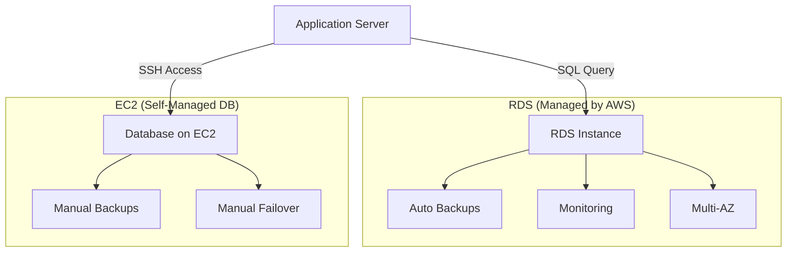
---

## 📈 RDS Storage Auto Scaling

* Automatically increases **storage size** as needed.
* Avoids manual scaling operations.

### ⚡ Triggers Auto-Scaling When:

* Free storage < **10%** of allocated storage
* Condition lasts **≥ 5 minutes**
* **6 hours** since last modification
* Within defined **Maximum Storage Threshold**

🧠 **Use Case:** Applications with **unpredictable workloads**.

✅ **Supported for all RDS engines.**

---

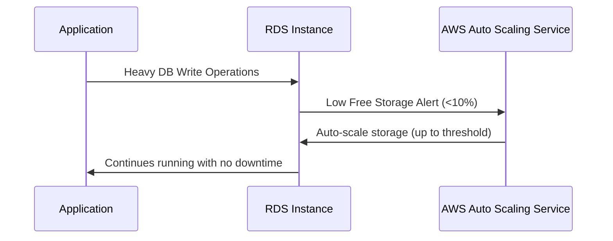

---

## 🧠 RDS Read Replicas (Read Scalability)

* Up to **15 Read Replicas**
* Can be in:

  * Same AZ
  * Cross-AZ
  * Cross-Region
* **Asynchronous replication** (eventually consistent)
* Replicas can be **promoted** to standalone DBs
* Apps must **update connection strings** to use them

---

### 🧾 Use Cases

* Run **reporting/analytics** workloads
* Reduce load on **production DB**
* Ideal for **read-heavy** operations (SELECT)
* Not for writes (INSERT, UPDATE, DELETE)

---

### 💸 Network Cost

* No cost for **intra-region** read replicas
* Data transfer costs apply **across regions**

---

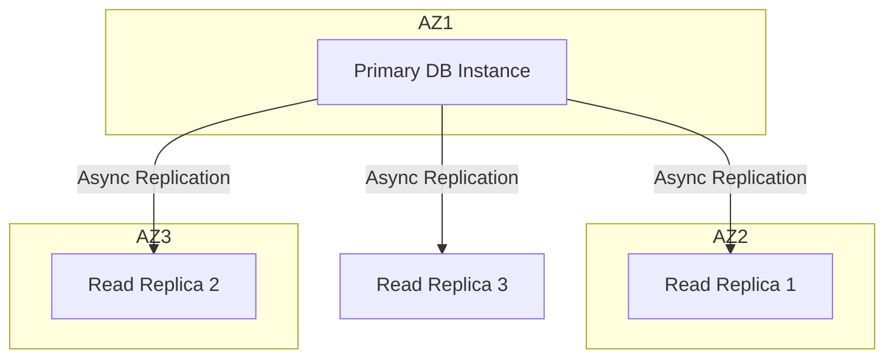

---

## 🛡️ RDS Multi-AZ (Disaster Recovery)

* **Synchronous replication** between primary and standby DB.
* **Automatic failover** using a single **DNS endpoint**.
* Improves **availability & resilience**.
* Used for **disaster recovery**, **not scaling**.
* Failover triggers:

  * AZ outage
  * Network failure
  * Storage/instance failure

---

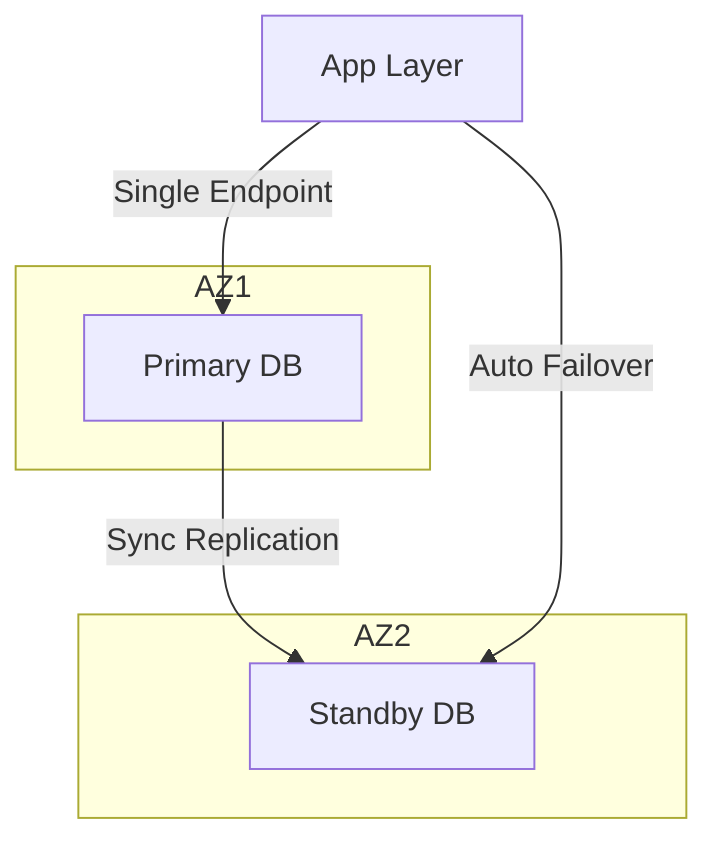

---

### 🔄 Convert Single-AZ to Multi-AZ (Zero Downtime)

Steps performed by AWS internally:

1. Snapshot current DB.
2. Restore snapshot in another AZ.
3. Establish **sync replication** link.

✅ No downtime
✅ Fully automated

---

# ⚡ Amazon Aurora

---

## 🧠 Overview

* **Aurora** is a **proprietary relational database** engine from AWS (not open source).
* Compatible with **MySQL** and **PostgreSQL** — your existing drivers work seamlessly.
* **AWS Cloud-Optimized** with:

  * Up to **5× faster than MySQL** on RDS
  * Up to **3× faster than PostgreSQL** on RDS
* **Storage auto-expands** in **10GB increments**, up to **128TB**.
* Up to **15 Read Replicas** with **<10 ms** replication lag.
* **Instant failover** with native **High Availability (HA)**.
* Costs ~**20% more than RDS**, but more **efficient and performant**.

---

## 🧩 Aurora High Availability and Read Scaling

* **6 copies** of data across **3 Availability Zones (AZs)**

  * **4/6** needed for **writes**
  * **3/6** needed for **reads**
* **Self-healing storage** using peer-to-peer replication
* **Storage is striped** across 100s of volumes for speed
* **1 Primary (Writer)** instance
* Up to **15 Read Replicas**
* **Failover < 30s**
* Supports **Cross-Region Replication** for global HA

---

### 🌐 Diagram – Aurora High Availability

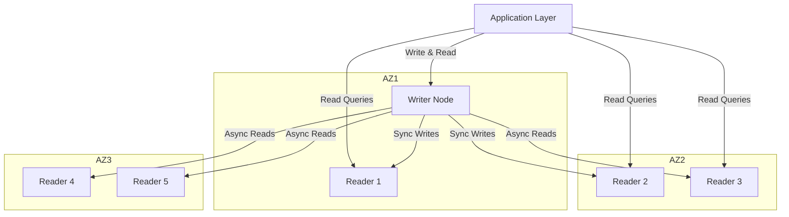

---

## 🏗️ Aurora DB Cluster Architecture

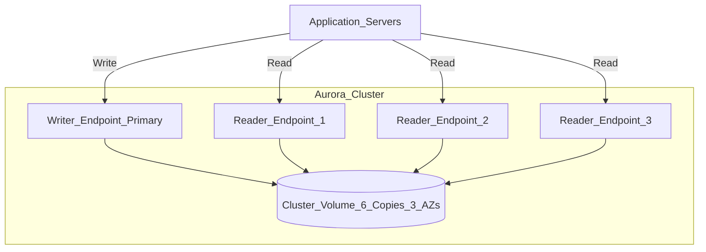

✅ **Explanation:**

* Aurora separates **Compute (instances)** and **Storage (cluster volume)**.
* All nodes share the same cluster volume.
* **Endpoints** simplify access:

  * `Writer endpoint` → single master
  * `Reader endpoint` → load-balanced across replicas

---

## ⚙️ Features of Aurora

| Feature                    | Description                               |
| -------------------------- | ----------------------------------------- |
| **Automatic Failover**     | Promotes replica to primary automatically |
| **Backup & Recovery**      | Continuous backups to S3                  |
| **Isolation & Security**   | VPC, KMS, IAM integration                 |
| **Compliance**             | PCI, HIPAA, FedRAMP, etc.                 |
| **Push-Button Scaling**    | Add replicas instantly                    |
| **Zero-Downtime Patching** | Seamless updates                          |
| **Advanced Monitoring**    | Integration with CloudWatch               |
| **Routine Maintenance**    | Managed by AWS                            |
| **Backtrack**              | Rewind DB state without restoring backup  |

---

# 🔐 RDS & Aurora Security

---

### 🛡️ At-Rest Encryption

* Uses **AWS KMS** to encrypt both **master** and **replica** DBs.
* Must be defined **at creation time**.
* To encrypt an unencrypted DB →
  **Take snapshot → restore as encrypted**.

### 🔒 In-Flight Encryption

* **TLS/SSL** enabled by default.
* Use **AWS TLS root certificates** for clients.

### 👤 IAM Authentication

* Connect using **IAM roles** (no passwords).

### 🌐 Security Groups

* Control **network access** to DBs (acts as firewall).

### 🚫 No SSH Access

* Except for **RDS Custom** instances.

### 🪵 Audit Logs

* Enable **CloudWatch Logs** for retention and analysis.

---

# 🧠 Amazon RDS Proxy

---

## Overview

* **Fully managed, serverless database proxy** for **RDS & Aurora**.
* Improves **efficiency** by pooling and sharing database connections.
* **Reduces stress** on DB (CPU, memory, connection limits).
* **Serverless**, **auto-scaling**, and **multi-AZ** by design.
* **Failover time** reduced by up to **66%**.
* Supports:

  * RDS: MySQL, PostgreSQL, MariaDB, MS SQL Server
  * Aurora: MySQL & PostgreSQL

---

### 💡 Benefits

* No code changes for most apps
* IAM Authentication support
* Secure credential storage via **AWS Secrets Manager**
* Never publicly accessible — must be inside **VPC**

---

### 🧭 Diagram – RDS Proxy Architecture

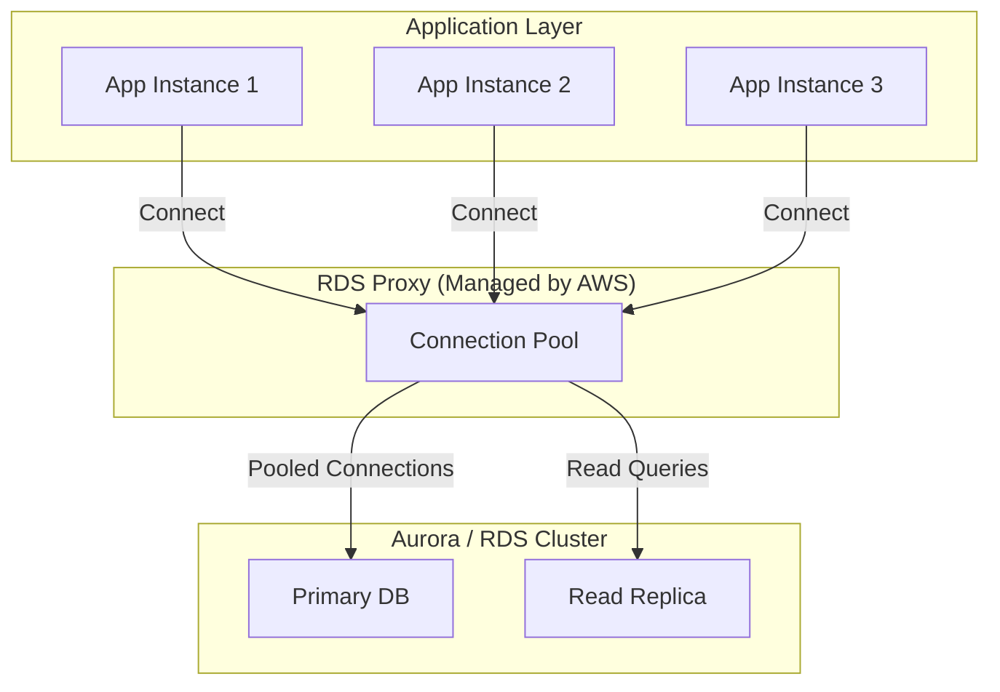

✅ **Explanation:**

* Apps open fewer DB connections → Proxy reuses pooled ones.
* Proxy handles **failover**, **authentication**, and **load balancing**.
* Ideal for **Lambda**, **Fargate**, or **ECS** where connection bursts occur.

---

### ⚙️ Summary Table

| Feature           | Aurora                      | RDS Proxy                |
| ----------------- | --------------------------- | ------------------------ |
| Type              | Managed Database            | Connection Manager       |
| Purpose           | High-Performance SQL Engine | Connection Pooling Layer |
| High Availability | 6 copies across 3 AZs       | Multi-AZ                 |
| Failover          | < 30 seconds                | 66% faster than DB alone |
| Security          | KMS, IAM, TLS               | IAM, Secrets Manager     |
| Scaling           | Up to 15 replicas           | Auto-scaling connections |
| Management        | Fully Managed               | Fully Managed            |

---

# 🧠 Amazon ElastiCache — Deep Dive Notes

---

## 🚀 1. Overview

ElastiCache is AWS’s **fully managed in-memory data store** service supporting **Redis** and **Memcached**.

It helps you build **high-performance, low-latency, and scalable** applications by caching frequently accessed data in-memory rather than repeatedly querying databases or APIs.

### 🔹 Key Highlights

* Like **RDS** (for managed relational DBs), **ElastiCache** provides **managed caching engines** (Redis & Memcached).
* Caches are **in-memory**, delivering **sub-millisecond latency**.
* Greatly **reduces load** on backend databases for read-heavy workloads.
* Helps make your applications **stateless** (ideal for horizontally scaled apps).
* AWS manages **OS patching, setup, scaling, monitoring, backups**, and **failover**.
* Requires **application code changes** to leverage caching logic.

---

## 🏗️ 2. ElastiCache Solution Architecture — DB Cache

Applications first check **ElastiCache** for data; if not found, they query **RDS** and store the result in cache for future requests.

* Reduces read load on RDS.
* Improves overall response time.
* Needs a **cache invalidation strategy** to ensure data freshness.

### 🔸 Diagram

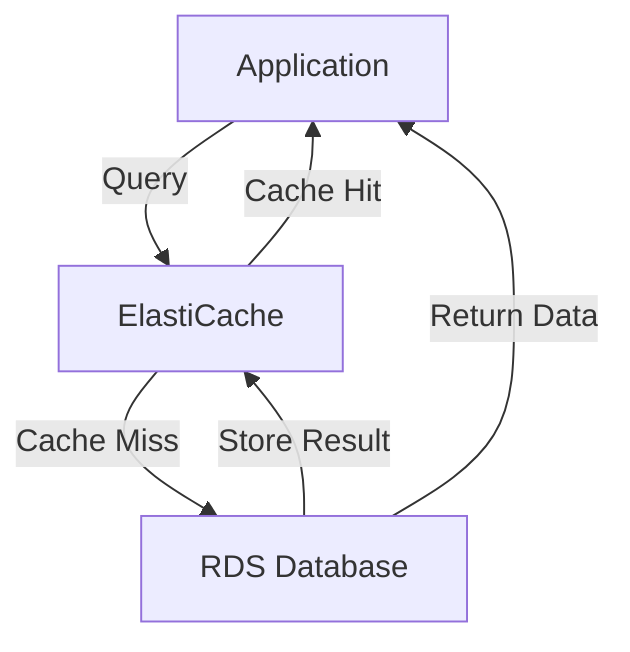

---

## 👥 3. ElastiCache Solution Architecture — User Session Store

Used for **session persistence** in stateless app environments.

* User logs into any instance of the app.
* Session data is stored in **ElastiCache**.
* On subsequent requests, even if the user hits a different app instance, their session is retrieved from cache.

### 🔸 Diagram

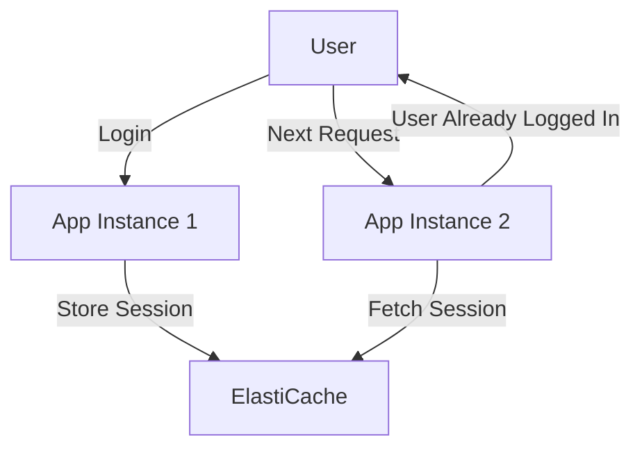

---

## ⚖️ 4. Redis vs Memcached — Feature Comparison

| Feature           | **Redis**                                   | **Memcached**              |
| ----------------- | ------------------------------------------- | -------------------------- |
| High Availability | ✅ Multi-AZ with Auto Failover               | ❌ Not supported            |
| Replication       | ✅ Yes (Read Replicas)                       | ❌ No                       |
| Durability        | ✅ AOF Persistence                           | ❌ Non-persistent           |
| Backup & Restore  | ✅ Supported                                 | ⚙️ Serverless / not native |
| Data Structures   | ✅ Strings, Lists, Sets, Sorted Sets, Hashes | ⚙️ Key-Value only          |
| Sharding          | ⚙️ Limited (Cluster mode)                   | ✅ Automatic                |
| Architecture      | Single-threaded                             | Multi-threaded             |

---

## 🧩 5. Caching Implementation Considerations

Before implementing caching, consider:

* **Safety:** Is it okay if cached data becomes slightly stale?
* **Effectiveness:** Is the data reused often enough to benefit from caching?
* **Pattern Suitability:**

  * ✅ Good: Data changes slowly, few hot keys reused frequently.
  * 🚫 Bad: Data changes constantly, wide key space.
* **Structure:** Is your data key–value friendly or aggregate query results?
* **Strategy:** Choose the right pattern (Lazy Loading, Write-Through, TTL, etc.).

🔗 Read more: [AWS Caching Implementation Considerations](https://aws.amazon.com/caching/implementation-considerations/)

---

## 💤 6. Lazy Loading / Cache-Aside Pattern

A **commonly used caching strategy** where data is loaded into cache **only when needed**.

### 🔹 Flow

1. App checks cache for data.
2. If not found → query DB.
3. Store DB result in cache.
4. Return response to user.

### ✅ Pros

* Cache only stores what’s needed.
* Failure of cache nodes isn’t catastrophic (cache repopulates automatically).

### ⚠️ Cons

* Cache miss penalty (extra round trips).
* Stale data possible if DB updates aren’t reflected in cache.

### 🔸 Diagram

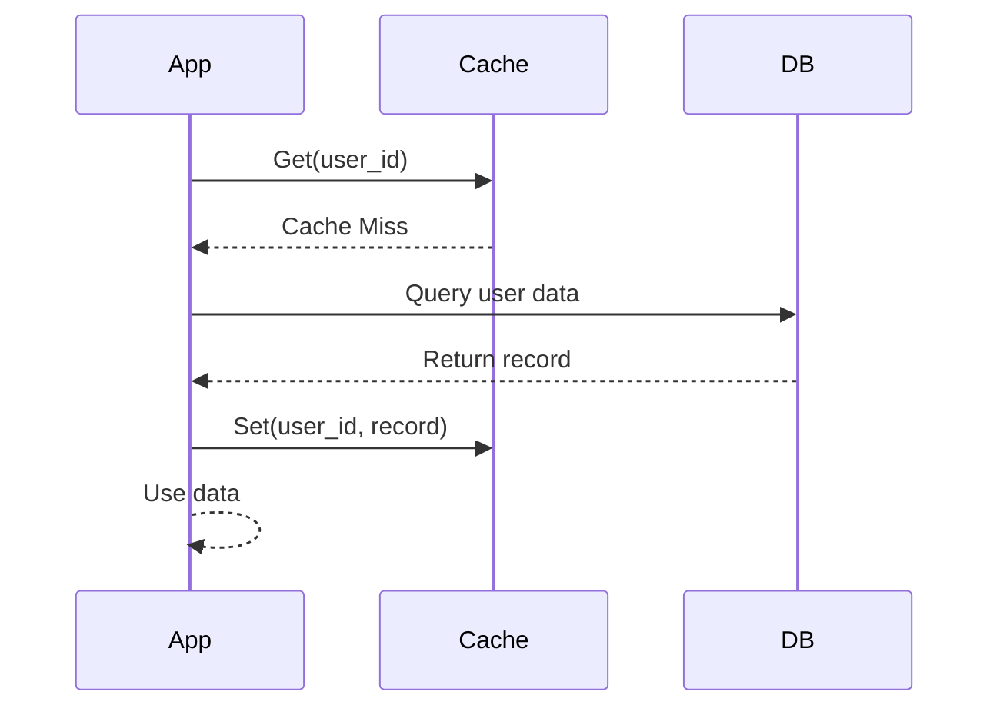

---

### 🐍 Python Pseudocode

```python
def get_user(user_id):
    # Check cache
    record = cache.get(user_id)

    if record is None:
        # Query database
        record = db.query("SELECT * FROM users WHERE id = ?", user_id)
        # Store in cache
        cache.set(user_id, record)
    return record

# Usage
user = get_user(17)
```

---

## ✍️ 7. Write-Through Pattern

Data is **written to cache and database simultaneously**, ensuring consistency.

### ✅ Pros

* Cache data is always up-to-date.
* Fast reads (cache is pre-populated).

### ⚠️ Cons

* Each write = 2 calls (DB + cache).
* Cache churn (may store unused data).
* Often combined with Lazy Loading for efficiency.

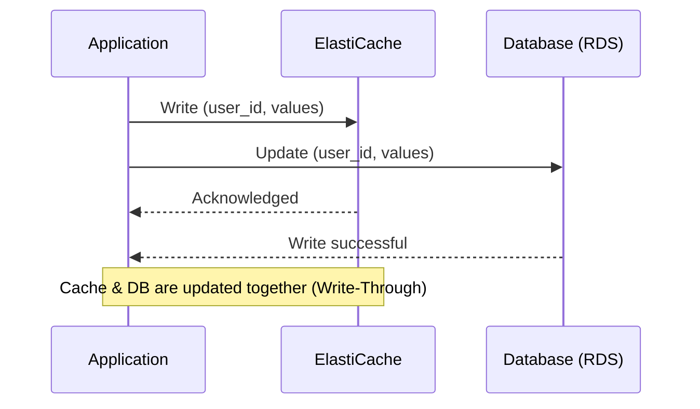

### 🔸 Python Pseudocode

```python
def save_user(user_id, values):
    # Save to DB
    record = db.query("UPDATE users SET ... WHERE id = ?", user_id, values)
    # Update cache
    cache.set(user_id, record)
    return record

# Usage
user = save_user(17, {"name": "Nate Dogg"})
```

---

## ⏳ 8. Cache Evictions & TTL (Time-To-Live)

### 🧮 Eviction Methods

1. **Manual Deletion** – app explicitly removes cache entry.
2. **LRU (Least Recently Used)** – cache evicts old data when memory fills.
3. **TTL Expiration** – items auto-expire after a set time.

### 📊 TTL Use Cases

* Leaderboards
* Comments
* Activity Streams
* Feed data

Set TTLs carefully:

* Too short → frequent DB hits.
* Too long → stale data risk.
* Too many evictions → scale up or out.

---

## 💡 9. Best Practices & Final Thoughts

* Use **Lazy Loading / Cache-Aside** for read-heavy workloads.
* Combine **Write-Through** with Lazy Loading for balanced caching.
* Always configure **sensible TTLs**.
* Cache **only frequently accessed, slowly changing data** (e.g., user profiles, blog pages).
* Remember the golden rule:

  > “There are only two hard things in Computer Science: cache invalidation and naming things.”

---

## ⚡ 10. Amazon MemoryDB for Redis

**MemoryDB** is a **Redis-compatible, durable in-memory database** — ideal when you need the performance of cache + durability of a database.

### 🔹 Features

* Fully **Redis-compatible**.
* **Multi-AZ**, with a durable **transaction log**.
* Handles **160M+ requests/sec**.
* Scales from **tens of GBs to hundreds of TBs**.
* Great for **real-time apps**, **gaming**, **media streaming**, and **session-heavy** systems.

---
