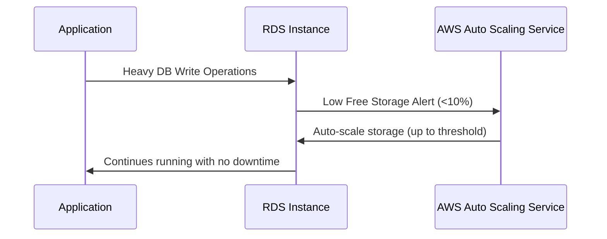
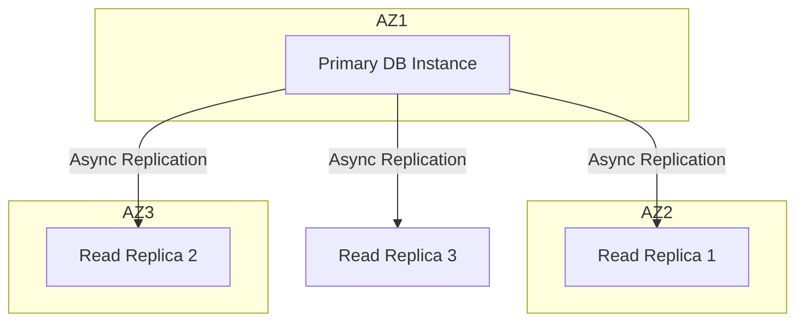
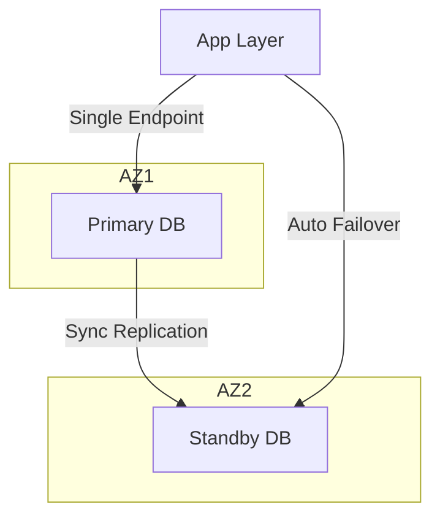

Here’s an **enhanced, structured version** of your notes on **Amazon RDS, Aurora, & ElastiCache**, with **clear sections**, **extra explanations**, and **Mermaid diagrams** to visualize key concepts.

---

# ☁️ RDS, Aurora, & ElastiCache

---

## 🧩 Amazon RDS Overview

* **RDS** = Relational Database Service
* Managed AWS service for databases using **SQL** as a query language.
* Lets you create fully-managed cloud databases.

### ✅ Supported Database Engines

* PostgreSQL
* MySQL
* MariaDB
* Oracle
* Microsoft SQL Server
* IBM DB2
* **Amazon Aurora** (AWS Proprietary, MySQL & PostgreSQL compatible)

---

## ⚙️ Why Use RDS Instead of DB on EC2

### 🏗️ RDS is a Managed Service

* Automated provisioning & **OS patching**
* **Continuous backups** with **Point-in-Time Restore**
* **Monitoring dashboards**
* **Read Replicas** for read scalability
* **Multi-AZ setup** for disaster recovery
* **Maintenance windows** for version upgrades
* **Automatic scaling** (storage & compute)
* **EBS-backed storage**
* ❌ **No SSH access** to RDS instances (AWS manages the OS level)

---

### 🔁 RDS vs EC2 Architecture

```mermaid
graph TD
    subgraph RDS
        B[RDS Instance (Managed by AWS)]
        B1[Auto Backups]
        B2[Monitoring]
        B3[Multi-AZ]
        B --> B1
        B --> B2
        B --> B3
    end

    subgraph EC2
        C[EC2 with Self-Managed DB]
        C1[Manual Backups]
        C2[Manual Failover]
        C --> C1
        C --> C2
    end

    A[Application Server] -->|SQL Query| B
    A -->|SSH Access| C

```

---

## 📈 RDS Storage Auto Scaling

* Automatically increases **storage size** as needed.
* Avoids manual scaling operations.

### ⚡ Triggers Auto-Scaling When:

* Free storage < **10%** of allocated storage
* Condition lasts **≥ 5 minutes**
* **6 hours** since last modification
* Within defined **Maximum Storage Threshold**

🧠 **Use Case:** Applications with **unpredictable workloads**.

✅ **Supported for all RDS engines.**

---



---

## 🧠 RDS Read Replicas (Read Scalability)

* Up to **15 Read Replicas**
* Can be in:

  * Same AZ
  * Cross-AZ
  * Cross-Region
* **Asynchronous replication** (eventually consistent)
* Replicas can be **promoted** to standalone DBs
* Apps must **update connection strings** to use them

---

### 🧾 Use Cases

* Run **reporting/analytics** workloads
* Reduce load on **production DB**
* Ideal for **read-heavy** operations (SELECT)
* Not for writes (INSERT, UPDATE, DELETE)

---

### 💸 Network Cost

* No cost for **intra-region** read replicas
* Data transfer costs apply **across regions**

---



---

## 🛡️ RDS Multi-AZ (Disaster Recovery)

* **Synchronous replication** between primary and standby DB.
* **Automatic failover** using a single **DNS endpoint**.
* Improves **availability & resilience**.
* Used for **disaster recovery**, **not scaling**.
* Failover triggers:

  * AZ outage
  * Network failure
  * Storage/instance failure

---



---

### 🔄 Convert Single-AZ to Multi-AZ (Zero Downtime)

Steps performed by AWS internally:

1. Snapshot current DB.
2. Restore snapshot in another AZ.
3. Establish **sync replication** link.

✅ No downtime
✅ Fully automated

---
