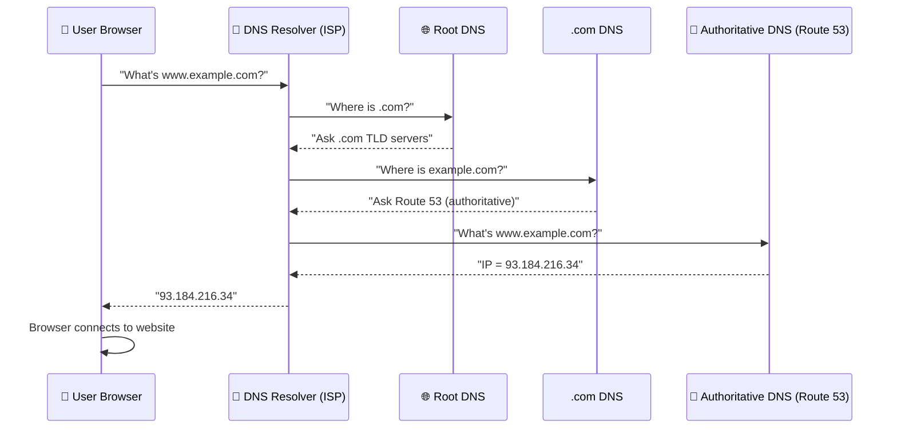
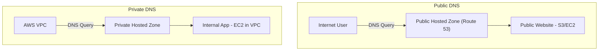
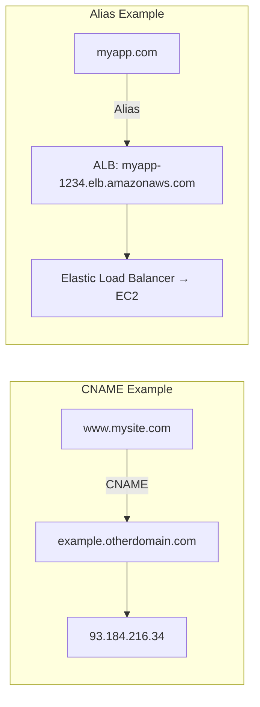
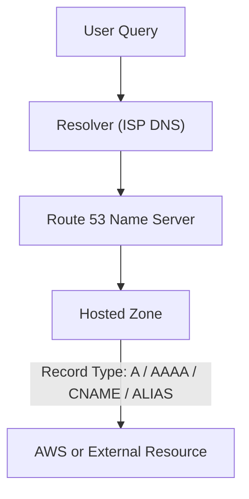

# 🌍 **Amazon Route 53 – Complete Guide**

---

## 🧠 What is DNS?

**DNS (Domain Name System)** translates **human-readable names** like `www.google.com` into **machine IP addresses** like `172.217.18.36`.

📦 Think of DNS as the **Internet’s phonebook** — it helps browsers find websites by name.

```
www.google.com  ➜  172.217.18.36
```

### 🌳 Hierarchical Naming Structure

```
. (Root)
 └── .com (TLD)
      └── example.com (SLD)
           ├── www.example.com
           └── api.example.com
```

---

## 📚 **DNS Terminologies**

| Term                          | Description                                       | Example                   |
| ----------------------------- | ------------------------------------------------- | ------------------------- |
| **Domain Registrar**          | Company where you register a domain.              | Amazon Route 53, GoDaddy  |
| **DNS Records**               | Entries that define how to route traffic.         | A, AAAA, CNAME, NS, etc.  |
| **Zone File**                 | File that stores DNS records.                     | Records for `example.com` |
| **Name Server**               | Answers DNS queries (Authoritative or Recursive). | ns1.route53.aws.com       |
| **TLD (Top Level Domain)**    | Highest level domain extension.                   | `.com`, `.org`, `.in`     |
| **SLD (Second Level Domain)** | Your unique name before the TLD.                  | `amazon.com`              |

---

## ⚙️ **How DNS Works**

Let’s visualize how a browser finds `www.example.com` 👇



---

## ☁️ **Amazon Route 53 Overview**

| Feature           | Description                                            |
| ----------------- | ------------------------------------------------------ |
| **Type**          | Fully managed, scalable, **Authoritative DNS service** |
| **Registrar**     | Can register domain names                              |
| **Health Checks** | Monitors endpoint health                               |
| **SLA**           | 100% availability                                      |
| **Name**          | “53” = TCP/UDP port number used by DNS                 |

---

## 🧩 **DNS Record Structure**

Each DNS record has:

| Field                  | Description          | Example                          |
| ---------------------- | -------------------- | -------------------------------- |
| **Name**               | Domain/subdomain     | `example.com`                    |
| **Type**               | Record type          | A / AAAA / CNAME                 |
| **Value**              | Target IP/hostname   | `192.0.2.1`                      |
| **Routing Policy**     | How to route traffic | Weighted / Latency / Geolocation |
| **TTL (Time To Live)** | Cache duration       | 300 seconds                      |

---

## 🌐 **Must-Know DNS Records**

| Record    | Full Form      | Purpose                             | Example                                    |
| --------- | -------------- | ----------------------------------- | ------------------------------------------ |
| **A**     | Address Record | Maps domain → IPv4                  | `example.com → 93.184.216.34`              |
| **AAAA**  | IPv6 Address   | Maps domain → IPv6                  | `example.com → 2606:2800:220:1::25c8:1946` |
| **CNAME** | Canonical Name | Creates alias domain → domain       | `www → example.com`                        |
| **NS**    | Name Server    | Specifies authoritative DNS servers | `ns1.route53.aws.com`                      |

---

## 🧠 **Advanced DNS Records**

| Record    | Full Form                   | Purpose                             | Example                                    |
| --------- | --------------------------- | ----------------------------------- | ------------------------------------------ |
| **MX**    | Mail Exchange               | Email delivery target               | `mail.example.com (priority 10)`           |
| **TXT**   | Text Record                 | Verification / SPF / DKIM           | `v=spf1 include:_spf.google.com ~all`      |
| **SPF**   | Sender Policy Framework     | Email spoofing protection (via TXT) | `v=spf1 ip4:192.0.2.0/24 -all`             |
| **SRV**   | Service Locator             | Specifies service + port            | `_sip._tcp.example.com:5060`               |
| **SOA**   | Start of Authority          | Domain admin + refresh info         | `ns1.example.com hostmaster@example.com`   |
| **PTR**   | Pointer Record              | Reverse lookup (IP → domain)        | `34.216.184.93.in-addr.arpa → example.com` |
| **CAA**   | Certificate Authority Auth. | Controls who can issue SSL certs    | `0 issue "letsencrypt.org"`                |
| **DS**    | Delegation Signer           | DNSSEC record                       | Links parent & child zones                 |
| **NAPTR** | Naming Authority Pointer    | Used for SIP/VoIP                   | `_sip.example.com`                         |

---

## 📦 **Hosted Zones in Route 53**

| Type                    | Use Case                           | Example                    |
| ----------------------- | ---------------------------------- | -------------------------- |
| **Public Hosted Zone**  | Routes traffic on the **Internet** | `app.mycompany.com`        |
| **Private Hosted Zone** | Routes traffic **inside AWS VPCs** | `internal.mycompany.local` |

💰 **Cost:** $0.50/month per hosted zone.

### Diagram: Public vs Private Hosted Zone



---

## ⏱️ **Route 53 – TTL (Time To Live)**

**TTL** defines how long a DNS record is **cached** by DNS resolvers.

### Example Flow

1. User asks ISP DNS → “What is example.com?”
2. ISP DNS gets answer from Route 53 → caches for `TTL` seconds.
3. For next requests within TTL, it uses the **cached** answer.

---

### 📊 TTL Impacts

| TTL Value                        | Behavior       | Pros                            | Cons                     |
| -------------------------------- | -------------- | ------------------------------- | ------------------------ |
| **High TTL (e.g. 86400s = 24h)** | Cached longer  | Less Route 53 queries (cheaper) | Updates propagate slowly |
| **Low TTL (e.g. 60s)**           | Cached briefly | Faster DNS change               | More DNS lookups ($$)    |

🧩 **Note:** TTL is mandatory for all records except **Alias**.

---

## 🧭 **CNAME vs Alias**

| Feature                   | **CNAME**                       | **Alias**                             |
| ------------------------- | ------------------------------- | ------------------------------------- |
| **Purpose**               | Redirects one domain to another | Redirects domain to **AWS resources** |
| **Supports Root Domain?** | ❌ No (`example.com`)            | ✅ Yes                                 |
| **Target**                | Any domain                      | AWS resource (ELB, CF, S3, etc.)      |
| **TTL Control**           | Yes                             | No (managed by AWS)                   |
| **Cost**                  | Regular DNS                     | Free                                  |
| **Health Check Support**  | No                              | Yes (native)                          |

---

### 🧱 **Alias Record Targets**

✅ Can point to:

* Elastic Load Balancer (ALB/NLB)
* CloudFront Distribution
* API Gateway
* Elastic Beanstalk
* S3 Static Website
* VPC Interface Endpoint
* Global Accelerator
* Route 53 record (same hosted zone)

❌ Cannot point to:

* EC2 public DNS names

---

### Visual: Alias vs CNAME



---

## ✅ **Summary Diagram**



---

# 🧭 **Amazon Route 53 – Routing Policies & Health Checks**

---

## 🌍 What Routing Policies Do

* **Define how Route 53 answers DNS queries.**
* **Not actual traffic routing** — DNS only *resolves* names → IPs.
* **Not the same as load balancer routing.**

---

## ⚙️ **Supported Routing Policies**

| Policy                        | Purpose                                                     | Can Use Health Checks | Notes / Use Case                       |
| ----------------------------- | ----------------------------------------------------------- | --------------------- | -------------------------------------- |
| **Simple**                    | Return one record (random if multiple).                     | ❌                     | Single resource, no failover.          |
| **Weighted**                  | Split traffic % by weight.                                  | ✅                     | A/B testing, gradual rollout.          |
| **Latency-based**             | Choose lowest latency region.                               | ✅                     | Global users → nearest region.         |
| **Failover (Active-Passive)** | Use primary unless unhealthy → fail to backup.              | ✅                     | DR setup.                              |
| **Geolocation**               | Route based on user’s location.                             | ✅                     | Localization, content restrictions.    |
| **Geoproximity**              | Route based on resource + user location, with bias control. | ✅                     | Regional control via **Traffic Flow**. |
| **IP-based**                  | Match client CIDR to endpoint.                              | ✅                     | ISP-based optimization.                |
| **Multi-Value Answer**        | Return multiple healthy IPs.                                | ✅                     | Simple load balancing (not ELB).       |

---

## 🧠 **Routing Policy Highlights**

### 🟦 Simple

* One record or multiple → random client selection.
* Alias allowed (only one AWS resource).
* No health check association.

### 🟩 Weighted

* % Traffic = RecordWeight ÷ SumOfAllWeights.
* Weights need not total 100.
* Weight = 0 → temporarily remove resource.
* Great for **blue-green deployments** or gradual rollout.

### 🟧 Latency-based

* Chooses region with lowest latency (based on AWS metrics).
* Prioritizes **performance**.
* Can failover when combined with health checks.

### 🟥 Failover

* **Active-Passive setup**.

  * Primary = Active.
  * Secondary = Passive until primary unhealthy.

### 🟨 Geolocation

* Based on user location (Continent → Country → State).
* Must define a **Default record**.
* Used for **regional content, compliance**.

### 🟪 Geoproximity (via Traffic Flow)

* Bias values:

  * +ve → expand region (more traffic).
  * –ve → shrink region (less traffic).
* Can target AWS Regions or latitude/longitude.

### 🟫 IP-based

* Map client CIDR ranges → specific endpoints.
* Example: ISP-specific routing.

### ⚪ Multi-Value Answer

* Returns multiple healthy IPs (≤ 8).
* Simple load distribution.
* Each record can have a health check.

---

## ❤️ **Health Checks**

### 🔹 What They Do

* **Public endpoints only** (directly).
* Used for **automated DNS failover**.

### 🔹 Types

1. **Endpoint** — checks HTTP/HTTPS/TCP directly.
2. **Calculated** — combines multiple health checks with AND/OR/NOT.
3. **CloudWatch Alarm–based** — for private or custom metrics.

### 🔹 Endpoint Details

* ~15 global health checkers.
* Threshold = 3 (default); Interval = 30 s / 10 s (costly).
* Healthy if > 18% checkers succeed.
* Only passes for HTTP 2xx/3xx.
* Can inspect first 5120 bytes of response.
* Allow inbound requests from Route 53 checkers in firewall.

### 🔹 Calculated Health Checks

* Combine up to 256 child checks.
* Logic: AND / OR / NOT.
* Useful during maintenance.

### 🔹 Private Resources

* Checkers can’t reach VPC.
* Use **CloudWatch Metric + Alarm + Health Check** chain.

---

## 🌐 **Traffic Flow**

* Visual policy editor for complex routing logic.
* Allows **versioned configurations**.
* Applies across hosted zones.

---

## 🏷️ **Domain Registrar vs. DNS Service**

| Concept              | Function                            | Example                   |
| -------------------- | ----------------------------------- | ------------------------- |
| **Domain Registrar** | Owns & sells domain names.          | GoDaddy, Amazon Registrar |
| **DNS Service**      | Manages DNS records (Hosted Zones). | Amazon Route 53           |

➡ Example: Buy domain on **GoDaddy**, use **Route 53** for DNS.

**Steps to connect:**

1. Create Hosted Zone in Route 53.
2. Copy its **NS records**.
3. Update them on Registrar’s site.

---

## 🧩 **Example: DNS Flow**


---
