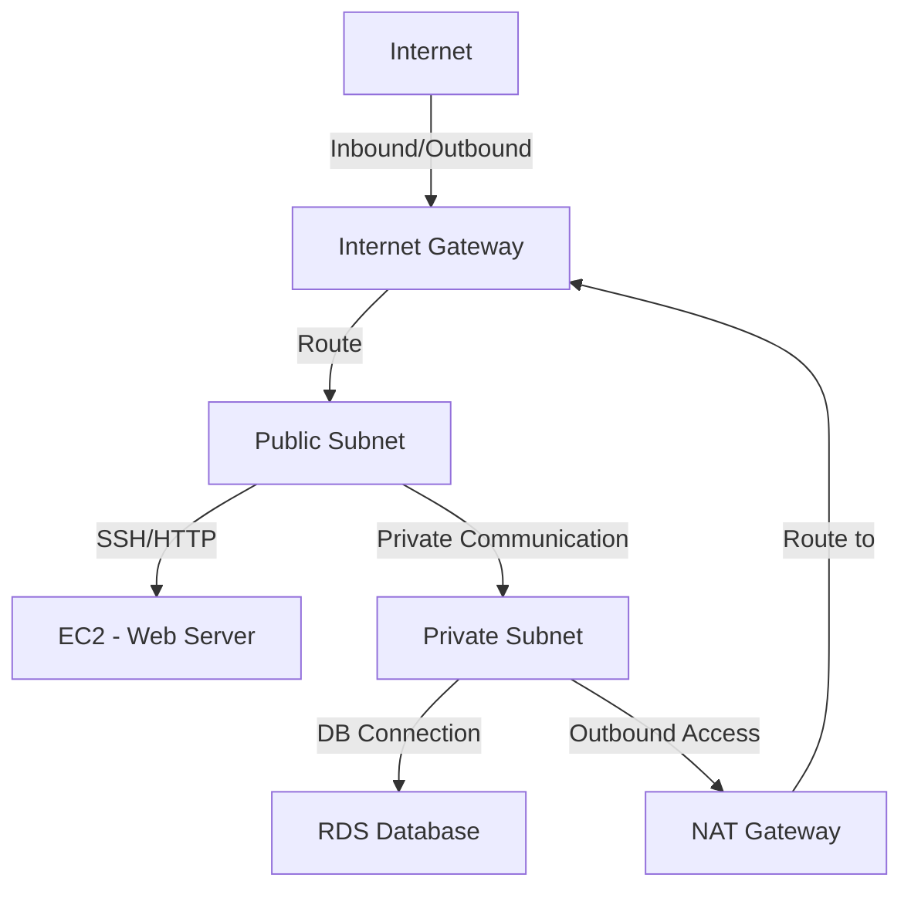
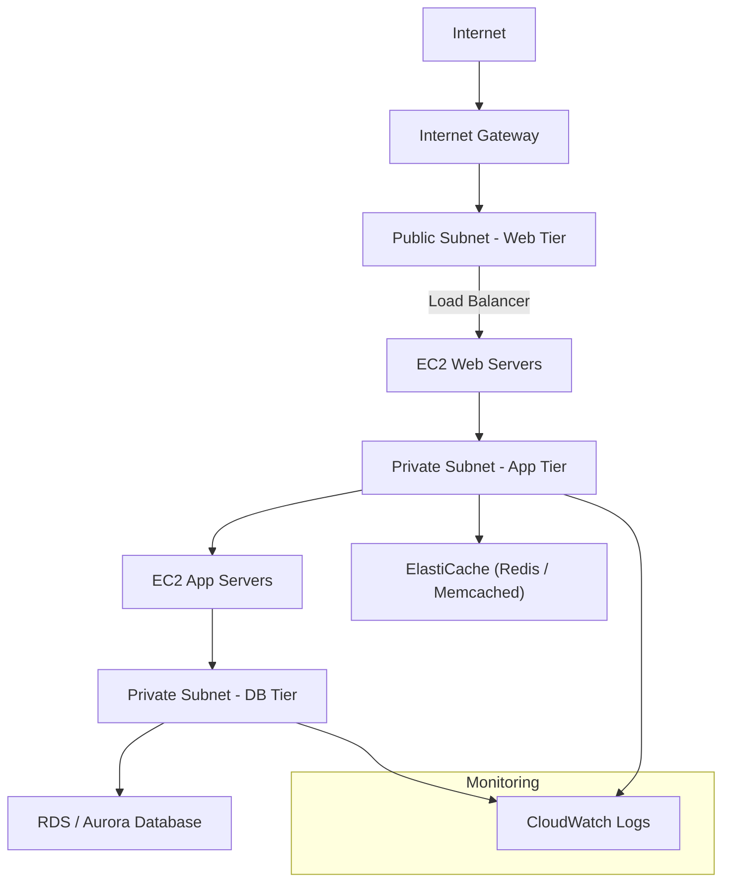
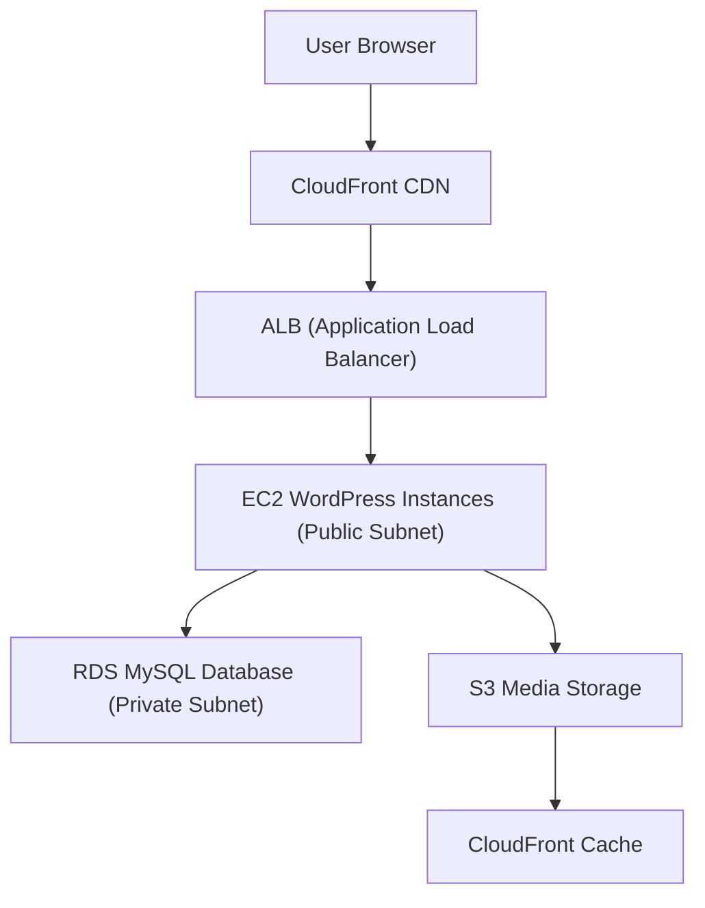
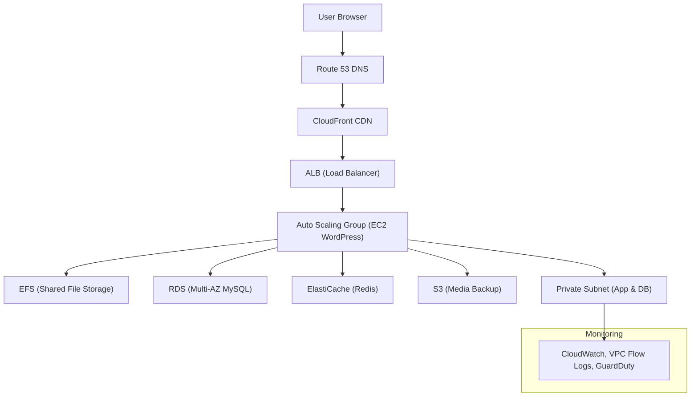
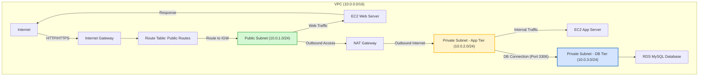

# 🏗️ **Amazon VPC (Virtual Private Cloud)**

---

## 🚀 **VPC Introduction**

A **VPC (Virtual Private Cloud)** is your **own isolated virtual network** within AWS. It allows you to:

* Launch AWS resources (like EC2, RDS, Lambda) in a **controlled environment**.
* Define **IP address ranges, subnets, route tables, firewalls**, and more.
* Securely **connect** your cloud resources to the **internet**, **other VPCs**, or **on-premises networks**.

🟩 **Key Concept:**
VPC is a **regional resource** — it spans **all Availability Zones (AZs)** within a region.

---

## 🌐 **VPC & Subnets Primer**

| Concept            | Description                                                                                       |
| ------------------ | ------------------------------------------------------------------------------------------------- |
| **VPC**            | A private network to deploy AWS resources.                                                        |
| **Subnet**         | A logical partition of your VPC (tied to one Availability Zone).                                  |
| **Public Subnet**  | Connected to the **Internet Gateway (IGW)** — accessible from the internet.                       |
| **Private Subnet** | No direct internet access — typically used for databases, backend services.                       |
| **Route Table**    | Defines how traffic is directed (e.g., to the Internet Gateway, NAT Gateway, or between subnets). |

🧭 **Tip:**
Each subnet must be explicitly associated with a route table. Otherwise, it uses the **main route table** by default.

---

## 🗺️ **VPC Diagram (Conceptual)**

---

## 🌉 **Internet Gateway (IGW) & NAT Gateways**

### 🛰️ Internet Gateway

* Enables instances in **public subnets** to access the internet.
* One Internet Gateway per VPC.
* Must be attached to the VPC and referenced in a **route table**.

### 🔒 NAT Gateway / NAT Instance

* Allows **private subnet instances** to **initiate** outbound traffic to the internet.
* Prevents **inbound** connections from the internet.
* **NAT Gateway** is AWS-managed (highly available, scalable, pay-per-use).
* **NAT Instance** is self-managed, customizable, but less reliable.

📘 **Example:**

| Subnet Type    | Internet Access  | Uses                       |
| -------------- | ---------------- | -------------------------- |
| Public Subnet  | Direct via IGW   | Web servers, bastion hosts |
| Private Subnet | Outbound via NAT | Databases, backend apps    |

---

## 🔐 **Network ACLs (NACL) & Security Groups**

| Feature     | **Network ACL (NACL)**                    | **Security Group (SG)**   |
| ----------- | ----------------------------------------- | ------------------------- |
| Level       | Subnet                                    | Instance / ENI            |
| Rules       | Allow **and** Deny                        | Allow **only**            |
| Stateful?   | ❌ Stateless                               | ✅ Stateful                |
| Rule Order  | Processed in order                        | Evaluates all rules       |
| Association | Auto-applies to all instances in a subnet | Must be manually attached |

### 🧩 Example:

* **NACL:** Blocks a specific IP range across the subnet.
* **Security Group:** Allows SSH (port 22) only from your office IP.

🧠 **Tip:**
Combine both — NACLs as coarse subnet firewalls, SGs for fine-grained instance-level security.

---

## 📊 **VPC Flow Logs**

* Capture detailed information about **IP traffic** within your VPC.
* Can be created at **VPC**, **Subnet**, or **ENI (Elastic Network Interface)** level.
* Used for:

  * Network troubleshooting
  * Security auditing
  * Traffic pattern analysis

📦 **Destinations:**

* Amazon **CloudWatch Logs**
* **S3** bucket
* **Kinesis Data Firehose**

✅ **Covers AWS-managed resources too** — like Load Balancers, RDS, ElastiCache, etc.

---

## 🤝 **VPC Peering**

* Connect **two VPCs** privately over AWS’s internal network.
* Enables instances to communicate as if on the same network.
* **No internet needed.**
* **Non-transitive:** Each pair of VPCs must have its own peering connection.
* **No overlapping CIDR blocks** allowed.

📘 **Use Case:**
Connecting a **dev VPC** and **prod VPC** for resource sharing (e.g., logging server).

---

## 🛜 **VPC Endpoints**

* Provide **private access** to AWS services **without using the public internet.**
* Improve **security** and **latency**.

| Type                   | Used For                | Description                                    |
| ---------------------- | ----------------------- | ---------------------------------------------- |
| **Gateway Endpoint**   | S3, DynamoDB            | Route traffic through a private gateway target |
| **Interface Endpoint** | Most other AWS services | Uses an ENI in your subnet with a private IP   |

🧠 **Example:**
Use an **S3 Gateway Endpoint** so EC2 in a private subnet can access S3 **without IGW/NAT**.

---

## 🌍 **Site-to-Site VPN & Direct Connect**

| Feature      | Site-to-Site VPN           | AWS Direct Connect                            |
| ------------ | -------------------------- | --------------------------------------------- |
| Connectivity | Over public internet       | Dedicated private fiber link                  |
| Encryption   | Encrypted (IPSec)          | Private link (can add VPN for extra security) |
| Setup Time   | Minutes                    | Weeks                                         |
| Speed        | Moderate (up to 1.25 Gbps) | High (1–100 Gbps)                             |
| Use Case     | Quick hybrid setup         | Long-term high-throughput private link        |

---

## 🧾 **VPC Summary (Cheat Sheet)**

| Component                  | Purpose                                |
| -------------------------- | -------------------------------------- |
| **VPC**                    | Virtual network environment            |
| **Subnet**                 | AZ-tied network partition              |
| **Internet Gateway**       | Provides internet access               |
| **NAT Gateway / Instance** | Outbound internet for private subnets  |
| **NACL**                   | Stateless firewall at subnet level     |
| **Security Group**         | Stateful firewall at instance level    |
| **VPC Peering**            | Private link between two VPCs          |
| **VPC Endpoint**           | Private AWS service access             |
| **VPC Flow Logs**          | Traffic monitoring and troubleshooting |
| **VPN / Direct Connect**   | Connect on-premises network to AWS     |

---

## 🏗️ **Typical 3-Tier Architecture (VPC)**

---

## 🧩 **LAMP Stack on AWS EC2**

| Component                         | Description                               |
| --------------------------------- | ----------------------------------------- |
| **Linux**                         | OS running on EC2 instances               |
| **Apache**                        | Web server serving HTTP requests          |
| **MySQL**                         | Database layer (preferably hosted on RDS) |
| **PHP**                           | Application logic, hosted on EC2          |
| **ElastiCache (Redis/Memcached)** | Optional caching layer                    |
| **EBS Volume**                    | Persistent storage for EC2                |

🧠 **Architecture Tip:**
Place Apache/PHP in a **public subnet**, MySQL in a **private subnet**, and connect through internal routing.

---

## 📰 **WordPress on AWS – Basic Architecture**

---

## 🧱 **WordPress on AWS – Scalable Architecture**

---
---

### 🏗️ **Example: 3-Tier VPC Architecture**

---

### 🧠 **Explanation**

* **Public Subnet:** Hosts web servers that serve internet traffic.
* **Private Subnet (App):** Hosts backend app logic. Communicates only internally.
* **Private Subnet (DB):** Contains the RDS database, isolated from the internet.
* **NAT Gateway:** Allows outbound internet from private subnets for updates.
* **Internet Gateway:** Enables inbound/outbound traffic to public resources.

---

