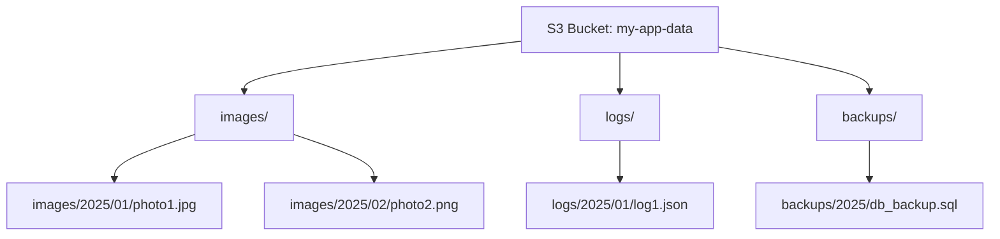
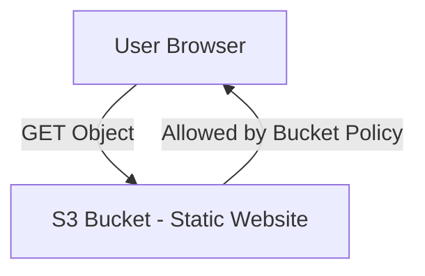
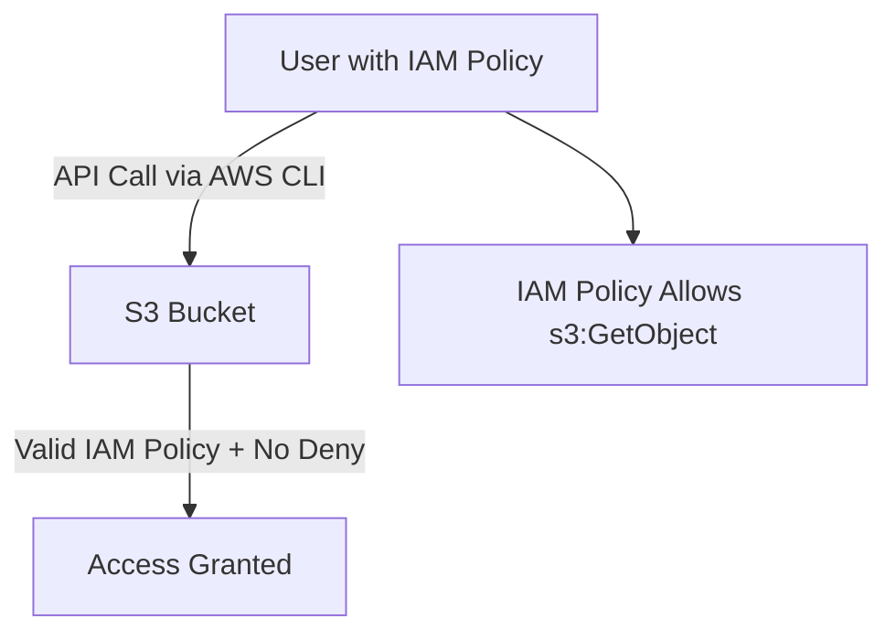
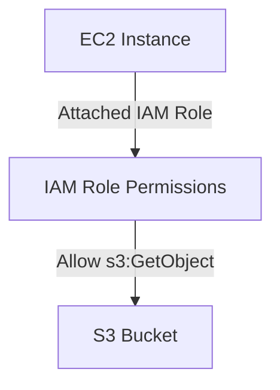
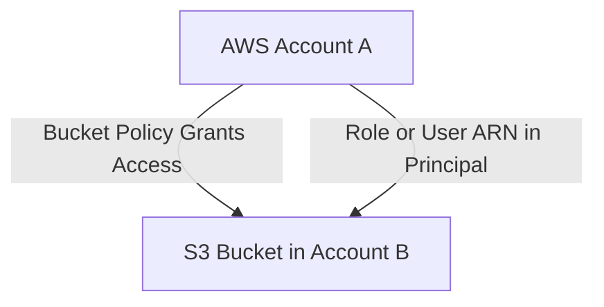
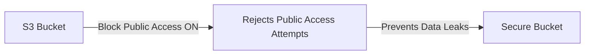
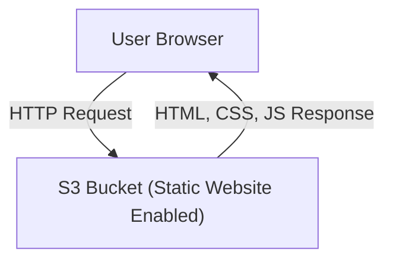
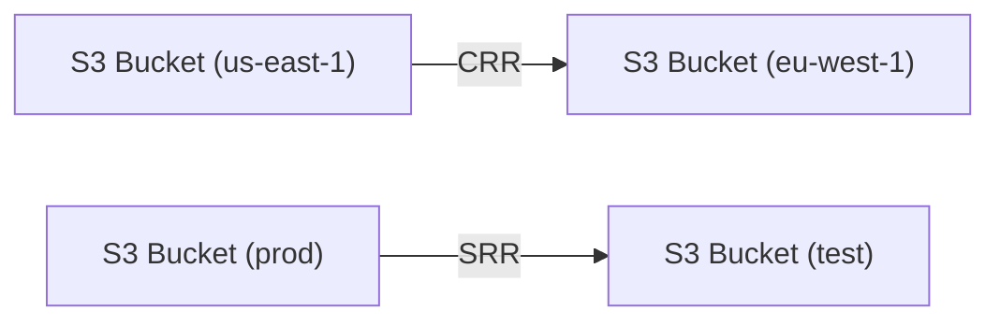
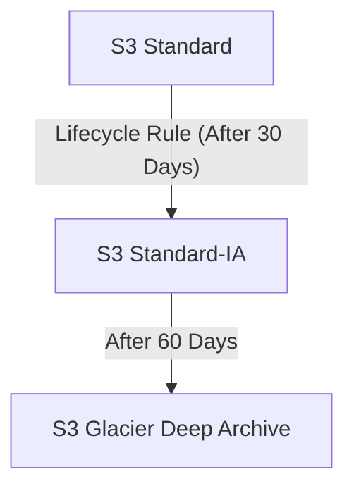

# ☁️ **Amazon S3 (Simple Storage Service)**

---

## 🧠 **Introduction**

**Amazon S3** (Simple Storage Service) is one of the **foundational services** of AWS — a **highly durable, scalable, and secure object storage** platform.

* Provides **infinite scalability** — you can store *unlimited* objects.
* Used as the **storage backbone** for AWS and many enterprise systems.
* Supports **11 nines of durability** (99.999999999%) — meaning your data is virtually never lost.
* Integrated with most AWS services — e.g., Lambda, CloudFront, Athena, Redshift, and Glue.

🧾 **AWS Exam Fact:**
S3 is an **object storage** — not block or file storage. (That’s EBS/EFS.)

---

## 💼 **Common Use Cases**

| Use Case                      | Description                                                                                      |
| ----------------------------- | ------------------------------------------------------------------------------------------------ |
| 🗃️ **Backup & Storage**      | Store backups from on-prem or EC2.                                                               |
| ☁️ **Disaster Recovery**      | Replicate data across Regions (Cross-Region Replication).                                        |
| 📦 **Archiving**              | Move infrequently accessed data to **Glacier** or **Deep Archive**.                              |
| 🔗 **Hybrid Cloud**           | Integrate with on-prem via **Storage Gateway**.                                                  |
| 💻 **Application Hosting**    | Store app assets, static content, logs, etc.                                                     |
| 🎥 **Media Hosting**          | Store videos, images, and serve them via **CloudFront** CDN.                                     |
| 📊 **Data Lakes / Analytics** | Centralize structured and unstructured data for **Athena**, **Redshift Spectrum**, **EMR**, etc. |
| 🚀 **Software Delivery**      | Host software packages or updates.                                                               |
| 🌐 **Static Website Hosting** | Host HTML/CSS/JS websites directly from S3.                                                      |

---

## 🪣 **Amazon S3 Buckets**

Buckets are **top-level containers** for your data (objects).
Think of them as your **root directory** in the S3 namespace.

* Buckets must have a **globally unique name**.
* Buckets are **region-specific** (you choose a region when creating one).
* Each bucket can contain an **unlimited number of objects**.

📦 **Example:**

```
s3://my-company-data
s3://myapp-production-images
s3://backup-eu-west-1
```

---

### 🧾 **Bucket Naming Rules**

| Rule                                                 | Example             |
| ---------------------------------------------------- | ------------------- |
| ✅ Only lowercase letters, numbers, dots, and hyphens | `my-app-bucket`     |
| ❌ No uppercase or underscores                        | `My_Bucket` ❌       |
| ✅ Length: 3–63 characters                            | `data-archive-2025` |
| ❌ Cannot look like an IP address                     | `192.168.1.1` ❌     |
| ❌ Cannot start with `xn--` or end with `-s3alias`    | —                   |

🧠 **Tip:**
Use naming conventions like `org-env-purpose-region`, e.g.,
`acme-prod-logs-us-east-1`.

---

## 📁 **Amazon S3 Objects**

Objects are the **actual files/data** stored in a bucket.
Each object consists of:

1. **Key** (the path or name)
2. **Value** (the data content)
3. **Metadata** (system + user-defined)
4. **Tags** (for organization and lifecycle)
5. **Version ID** (if versioning is enabled)

---

### 🔑 **Object Keys (Paths)**

The **key** represents the **full path** of the object.

📘 **Examples:**

```
s3://my-bucket/photo.jpg
s3://my-bucket/images/2025/01/photo.jpg
```

🧠 **Important:**
S3 **does not have real folders** — the “folders” you see in the console are just **key prefixes** (`images/2025/01/`).

---

### 📦 **Object Details**

| Feature                     | Description                                                   |
| --------------------------- | ------------------------------------------------------------- |
| **Max Size per Object**     | 5 TB                                                          |
| **Single PUT upload limit** | 5 GB (for larger, use *Multi-Part Upload*)                    |
| **Metadata**                | Key/value pairs for info like `Content-Type`, `Last-Modified` |
| **Tags**                    | Up to 10 key/value pairs for organization or lifecycle rules  |
| **Version ID**              | Unique per object version when versioning is enabled          |

🧰 **Example Upload:**

```
aws s3 cp report.pdf s3://my-bucket/reports/2025/
```

---

### 🧩 **Multi-Part Upload (for large files)**

When uploading files **larger than 5 GB**, S3 requires **multi-part upload**:

* The file is **split into chunks** (e.g., 10 MB each).
* Uploads parts **in parallel** for speed and fault tolerance.
* S3 reassembles the parts automatically when complete.

✅ **Benefits:**

* Faster, parallel uploads
* Resumable if interrupted
* Efficient error handling

---

## 🗺️ **Visual Overview – How S3 Organizes Data**



🧠 **Explanation:**
Even though you see “folders” (images/logs/backups), they’re just **key prefixes** in the object name.

---


# 🛡️ **Amazon S3 – Security**

Amazon S3 provides **multiple layers of security** for controlling access to data, both at the **user level** and **resource level**, plus **encryption** for protecting data at rest and in transit.

---

## 🔑 **1. Access Control Overview**

There are **two main access control types** in S3:

| Type                  | Mechanism                 | Scope                                | Example                                                |
| --------------------- | ------------------------- | ------------------------------------ | ------------------------------------------------------ |
| 🧍 **User-based**     | **IAM Policies**          | Applied to users, groups, or roles   | “Allow Alice to list objects in the dev bucket.”       |
| 📦 **Resource-based** | **Bucket Policies, ACLs** | Attached directly to buckets/objects | “Allow everyone to read from my public-assets bucket.” |

---

### 🧾 **IAM Policy (User-Based)**

Defined in **IAM** and specifies *which API actions* a user/role can perform.

```json
{
  "Version": "2012-10-17",
  "Statement": [{
    "Effect": "Allow",
    "Action": ["s3:ListBucket", "s3:GetObject"],
    "Resource": ["arn:aws:s3:::mybucket", "arn:aws:s3:::mybucket/*"]
  }]
}
```

➡️ Example: Allows listing and reading objects in `mybucket`.

---

### 🧱 **Bucket Policy (Resource-Based)**

Defined directly on the bucket itself — controls **who** can access the bucket and **what** they can do.

```json
{
  "Version": "2012-10-17",
  "Statement": [{
    "Sid": "PublicReadAccess",
    "Effect": "Allow",
    "Principal": "*",
    "Action": ["s3:GetObject"],
    "Resource": ["arn:aws:s3:::my-public-site/*"]
  }]
}
```

➡️ Example: Grants public read-only access (for static website hosting).

---

### ⚙️ **Access Control Lists (ACLs)**

Older method for granting specific **user or account** access to individual objects or buckets.

* **Bucket ACLs:** Apply to entire buckets
* **Object ACLs:** Apply to individual objects
* **Often disabled** (new AWS accounts have S3 ACLs off by default)
* Prefer **IAM Policies or Bucket Policies**

---

## ✅ **Access Evaluation Logic**

An IAM principal (user or role) can access an object **only if:**

```
( IAM Policy ALLOWS  OR  Resource Policy ALLOWS )
AND
( No explicit DENY )
```

🧠 **Tip:** Explicit **Deny** always overrides any Allow.

---

### 🔐 **Encryption in S3**

You can encrypt objects to ensure data confidentiality.

| Encryption Type            | Key Managed By | Description                          |
| -------------------------- | -------------- | ------------------------------------ |
| **SSE-S3**                 | AWS            | S3 manages encryption keys (AES-256) |
| **SSE-KMS**                | AWS KMS        | You manage the key through KMS       |
| **SSE-C**                  | Customer       | You provide your own key at upload   |
| **Client-Side Encryption** | Client         | Data encrypted before upload         |

🧾 Example use case:
Encrypt sensitive customer data using **SSE-KMS** with a **customer-managed key**.

---

## 🧩 **2. Bucket Policy Structure**

A **Bucket Policy** is written in JSON and includes:

* **Resources** → which bucket or objects it applies to
* **Effect** → `Allow` or `Deny`
* **Actions** → e.g., `s3:GetObject`, `s3:PutObject`
* **Principal** → who can access (user, account, or “*”)

📘 Example: **Force encryption on upload**

```json
{
  "Version": "2012-10-17",
  "Statement": [{
    "Sid": "DenyUnEncryptedObjectUploads",
    "Effect": "Deny",
    "Principal": "*",
    "Action": "s3:PutObject",
    "Resource": "arn:aws:s3:::my-secure-bucket/*",
    "Condition": {
      "StringNotEquals": {
        "s3:x-amz-server-side-encryption": "aws:kms"
      }
    }
  }]
}
```

➡️ This policy **denies uploads** unless KMS encryption is used.

---

## 🎯 **3. Common Access Scenarios (with Diagrams)**

---

### 🔸 **Example 1: Public Access (Static Website)**



✅ Use Case:
Static website content publicly available via S3 or CloudFront.
✅ Use **Bucket Policy** for read-only access.
❌ Don’t use public write access.

---

### 🔸 **Example 2: IAM User Access**



✅ IAM policy defines *which actions* the user can perform.
✅ The bucket must not have a deny rule.

---

### 🔸 **Example 3: EC2 Instance Access (IAM Role)**



✅ EC2 accesses S3 using its **instance role**, not access keys.
✅ Example: Web app reading images or logs from S3.

---

### 🔸 **Example 4: Cross-Account Access**



✅ Use **Bucket Policy** in Account B to **allow another AWS Account’s ARN**.
✅ Example: Central logging or shared data buckets.

---

## 🚫 **4. Block Public Access (BPA)**

AWS provides **account-level and bucket-level settings** to block accidental public access.

| Setting                      | Description                                        |
| ---------------------------- | -------------------------------------------------- |
| Block public ACLs            | Prevents public ACLs from granting access          |
| Ignore public ACLs           | Disables ACLs entirely                             |
| Block public bucket policies | Disallows bucket policies that grant public access |
| Restrict public buckets      | Applies account-wide restrictions                  |

🧠 **Best Practice:**
If you *never need public access*, keep **all BPA options ON** ✅.

---

### 🧭 **Visual: Block Public Access**



---

## 💡 **Security Best Practices**

| Category            | Recommendation                                       |
| ------------------- | ---------------------------------------------------- |
| **Access Control**  | Prefer IAM roles and bucket policies over ACLs.      |
| **Encryption**      | Use **SSE-KMS** for sensitive data.                  |
| **Public Data**     | Use **CloudFront** instead of making buckets public. |
| **Monitoring**      | Enable **S3 Access Logs** and **CloudTrail**.        |
| **Compliance**      | Use **AWS Config Rules** to detect public buckets.   |
| **Least Privilege** | Grant only necessary permissions per user/service.   |

---

## 🌐 **Static Website Hosting**

Amazon S3 can host **static websites** (HTML, CSS, JS, images) directly, without servers.

### ✅ Key Facts

* Only **static content** (no PHP, Node.js, etc.)
* Each bucket can be configured as a **website endpoint**
* **Region-specific URLs:**

```
http://bucket-name.s3-website-<aws-region>.amazonaws.com
```

If you see **403 Forbidden**, it usually means your bucket policy does not allow `s3:GetObject` for public or CloudFront access.

---

### 🪄 **Example: Hosting a Static Website**



### ⚙️ Steps

1. Upload your HTML/CSS/JS files to S3
2. Enable **Static Website Hosting** in bucket properties
3. Add a **Bucket Policy** that allows public read or connect via **CloudFront**
4. (Optional) Use **Route 53** for a custom domain

🧾 **Example Endpoint:**
`http://mywebsite.s3-website-us-east-1.amazonaws.com`

✅ **Best Practice:** Use **CloudFront** in front of your S3 bucket for caching, HTTPS, and geo-distribution.

---

## 🧬 **Versioning**

Versioning keeps **multiple versions of the same object**, protecting against accidental overwrites or deletions.

| Feature                | Description                                        |
| ---------------------- | -------------------------------------------------- |
| **Enabled per bucket** | You must enable versioning manually                |
| **Overwrites**         | Create a *new version* instead of replacing        |
| **Deletes**            | Place a *delete marker* (can restore old version)  |
| **Suspend**            | Stops new version creation but old versions remain |

### 🧠 Example

| Action       | Object Key   | Version ID      |
| ------------ | ------------ | --------------- |
| Upload file  | `index.html` | `v1`            |
| Upload again | `index.html` | `v2`            |
| Delete       | `index.html` | *delete marker* |

You can restore `v1` later if needed.
Versioning is essential for **replication, backups, and security.**

---

## 🌍 **Replication (CRR & SRR)**

Replication automatically copies objects between buckets.

### 🔧 Requirements

* Versioning **must** be enabled on both source & destination buckets.
* Replication is **asynchronous**.
* IAM role with `s3:ReplicateObject` permissions required.

### 🧩 Types

| Type                               | Scope              | Use Case                                            |
| ---------------------------------- | ------------------ | --------------------------------------------------- |
| **CRR – Cross-Region Replication** | Across AWS regions | Compliance, disaster recovery, latency optimization |
| **SRR – Same-Region Replication**  | Within same region | Log aggregation, production → test sync             |



### 🧠 Notes

* Only new objects are replicated after enabling
* Use **S3 Batch Replication** to copy existing data
* Delete markers can optionally replicate
* **No chaining:** Replication from Bucket1 → Bucket2 → Bucket3 does not cascade automatically

---

## 🧱 **Storage Classes Overview**

Amazon S3 offers **multiple storage classes** to balance cost, performance, and access frequency.

| Class                          | Availability | Durability    | Retrieval     | Typical Use Case                     |
| ------------------------------ | ------------ | ------------- | ------------- | ------------------------------------ |
| **Standard**                   | 99.99%       | 11 9’s        | Immediate     | Frequently accessed data, web assets |
| **Standard-IA**                | 99.9%        | 11 9’s        | Immediate     | Backups, disaster recovery           |
| **One Zone-IA**                | 99.5%        | 11 9’s (1 AZ) | Immediate     | Secondary backups                    |
| **Glacier Instant Retrieval**  | 99.9%        | 11 9’s        | Milliseconds  | Archival data, monthly reports       |
| **Glacier Flexible Retrieval** | 99.9%        | 11 9’s        | Minutes–hours | Deep archive, rarely accessed data   |
| **Glacier Deep Archive**       | 99.9%        | 11 9’s        | 12–48 hours   | Long-term retention (compliance)     |
| **Intelligent-Tiering**        | 99.9%        | 11 9’s        | Auto          | Unknown/variable access patterns     |

---

## 💾 **S3 Durability and Availability**

| Metric                         | Description                                                                            |
| ------------------------------ | -------------------------------------------------------------------------------------- |
| **Durability (99.999999999%)** | “11 nines” — if you store 10 million objects, expect to lose one every 10,000 years    |
| **Availability (99.99%)**      | How often your data is accessible — about **53 minutes downtime/year** for S3 Standard |

Durability applies **across multiple AZs**, ensuring redundancy.

---

## ⚡ **S3 Standard – General Purpose**

* **Durability:** 11 9’s
* **Availability:** 99.99%
* **Use cases:** Big data, mobile apps, content distribution, cloud-native apps
* **Supports:** High throughput & low latency

---

## 📦 **Infrequent Access (IA) Classes**

| Class           | Availability | Description                      | Use Case                            |
| --------------- | ------------ | -------------------------------- | ----------------------------------- |
| **Standard-IA** | 99.9%        | Lower cost for infrequent access | Backups, DR                         |
| **One Zone-IA** | 99.5%        | Single AZ, data lost if AZ fails | Secondary copies, re-creatable data |



---

## 🧊 **Glacier Family (Archival Storage)**

Optimized for **long-term, low-cost data archiving**.

| Class                          | Retrieval Time | Min Storage Duration | Use Case                      |
| ------------------------------ | -------------- | -------------------- | ----------------------------- |
| **Glacier Instant Retrieval**  | Milliseconds   | 90 days              | Monthly reports, archives     |
| **Glacier Flexible Retrieval** | 1 min – 12 hr  | 90 days              | Backups, compliance           |
| **Glacier Deep Archive**       | 12 – 48 hr     | 180 days             | Long-term archives (7+ years) |

Pricing includes **storage + retrieval cost**.

---

## 🧠 **Intelligent-Tiering**

Automatically moves objects between access tiers based on activity.

| Tier                       | Trigger              | Retrieval Cost | Use Case           |
| -------------------------- | -------------------- | -------------- | ------------------ |
| **Frequent Access**        | Default              | None           | Active data        |
| **Infrequent Access**      | 30 days of no access | None           | Warm data          |
| **Archive Instant Access** | 90 days              | None           | Cold data          |
| **Archive Access**         | 90–700+ days         | Paid           | Rarely accessed    |
| **Deep Archive Access**    | 180–700+ days        | Paid           | Compliance storage |

⚙️ **Use Cases**

* Data lakes with unpredictable access
* Automatically optimize cost
* Great for machine-generated or IoT data

---

## 📊 **S3 Storage Class Comparison**

| Feature              | Standard    | Standard-IA | One Zone-IA    | Glacier Instant           | Glacier Flexible | Glacier Deep       | Intelligent-Tiering |
| -------------------- | ----------- | ----------- | -------------- | ------------------------- | ---------------- | ------------------ | ------------------- |
| **Availability**     | 99.99%      | 99.9%       | 99.5%          | 99.9%                     | 99.9%            | 99.9%              | 99.9%               |
| **Durability**       | 11 9’s      | 11 9’s      | 11 9’s         | 11 9’s                    | 11 9’s           | 11 9’s             | 11 9’s              |
| **AZ Redundancy**    | Multi       | Multi       | Single         | Multi                     | Multi            | Multi              | Multi               |
| **Retrieval Time**   | ms          | ms          | ms             | ms                        | 1–12 hrs         | 12–48 hrs          | ms–hrs              |
| **Min Storage**      | None        | 30 days     | 30 days        | 90 days                   | 90 days          | 180 days           | None                |
| **Typical Use Case** | Active data | Backup      | Secondary data | Archive w/ fast retrieval | Deep archive     | Compliance archive | Auto-optimize       |

---
