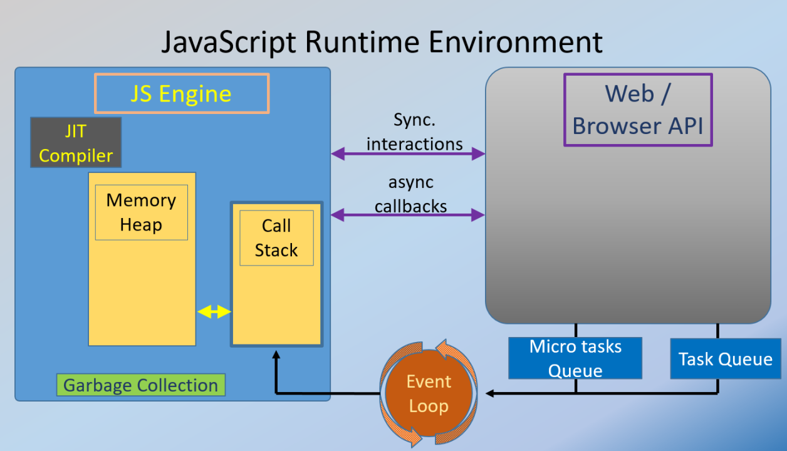
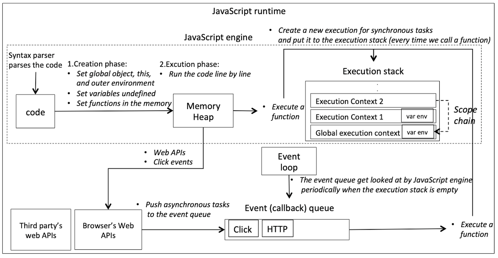

# Js Code Execution

## Js Code Execution Components



1. Memory Heap
   - Stores variables, function declarations, and objects.
   - Uses Garbage Collection (GC) to remove unused data.
2. Call Stack – Executes synchronous code.
   - A stack data structure that keeps track of function calls.
   - Functions are pushed onto the stack when invoked and popped when they return.
3. Web APIs – Handles setTimeout, fetch, event listeners, etc.
   - Includes APIs like setTimeout, DOM, fetch, console, and more.
   - These are provided by the browser, not JavaScript itself.
4. Microtask Queue – Handles Promises and MutationObserver.
   - Contains promises (Promise.then, MutationObserver).
   - Executes before the callback queue.
5. Callback Queue (Task Queue) – Handles setTimeout, setInterval, and events.
   - Stores callbacks from asynchronous tasks (e.g., setTimeout, fetch).
   - Callbacks are executed after the call stack is empty.
6. Event Loop – Coordinates execution of all queues.
   - Monitors the call stack and queues.
   - Moves tasks from the callback/microtask queue to the call stack when it's empty.
7. Animation Frame Queue – Handles requestAnimationFrame animations.
8. Rendering Engine – Repaints the UI at 60 FPS (ideally, ~16.67ms per frame).

## Execution Context in JavaScript

### In JavaScript, an execution context is an abstract concept representing the environment in which JavaScript code is executed. It's like a container that holds all the necessary information for the current piece of code to run, including variables, functions, and the scope chain.

### 1. Global Execution Context (GEC)

- Created once when a JavaScript file runs.
- It represents the global scope (window in browsers, global in Node.js).
- Holds global variables and functions.
- The this keyword refers to the global object (window in browsers).

```js
var name = "Ganesh";
function greet() {
  console.log("Hello");
}
```

- GEC stores:
  - name: "Ganesh"
  - greet: function

### 2. Function Execution Context (FEC)

- Created each time a function is invoked.
- Each function has its own local memory.
- It gets destroyed once the function completes execution.
- A function execution context consists of:
  1. Variable Environment (local variables, parameters)
  2. Lexical Environment (parent scope reference)
  3. Scope Chain (access to global and parent variables)
  4. this binding

```js
function sayHello(name) {
  var message = "Hello " + name;
  console.log(message);
}

sayHello("Ganesh");
```

1. GEC is created.
2. sayHello("Ganesh") → New Function Execution Context (FEC)
   - name = "Ganesh"
   - message = "Hello Ganesh"

### 3. Eval Execution Context (Rarely Used)

- Created when the eval() function is used.
- Executes code dynamically inside a separate execution context.
- Avoid using eval() due to security risks.

```js
eval("var a = 10; console.log(a);"); // Output: 10
```

- eval() creates a separate Eval Execution Context.

## Execution Context Phases



- Each execution context has two main phases:

1. Creation Phase (Memory Allocation)

   - Creates a new execution context.
   - Allocates memory for variables and functions.
   - Variables are set to undefined, and functions are stored as references.
   - this is set based on how the function is called.

2. Execution Phase (Code Execution)
   - Executes the code line by line.
   - Assigns values to variables.
   - Executes function calls and manages the call stack.

## Execution Context & Call Stack

- JavaScript uses a Call Stack to manage execution contexts.
- The Global Execution Context (GEC) is created first and stays until the script finishes.
- When a function is called, a Function Execution Context (FEC) is pushed onto the stack.
- When a function completes, its execution context is popped off the stack.

## JavaScript Execution Flow.


1. Global Execution Context (GEC) is Created

   - The this keyword is assigned.
   - The Memory Heap is initialized.

2. Execution Context Creation (For Every Function Call)

   - Memory Allocation Phase (Creation Phase)
     - Variables and functions are stored in memory (hoisting).
   - Code Execution Phase
     - Assigns values to variables.
     - Executes functions in the call stack.

3. Synchronous Code Execution

   - Runs from top to bottom in a single-threaded manner.

4. Asynchronous Code Handling

   - Web APIs handle async tasks (setTimeout, fetch).
   - Once completed, callbacks move to the task queue.
   - Promises (.then) go to the microtask queue (higher priority).

5. Event Loop Execution

   - Moves tasks from the microtask queue to the call stack first.
   - Then, moves tasks from the callback queue when the stack is empty.

## JavaScript Execution Order (Including Animations)

1. Call Stack Execution (Runs synchronous code)
2. Microtask Queue Execution (e.g., Promise.then, queueMicrotask)
3. Animation Frame Queue Execution (e.g., requestAnimationFrame)
4. Callback Queue Execution (e.g., setTimeout, setInterval, fetch callbacks)

## Types of Scope in JavaScript

- In JavaScript, scope determines where a variable can be accessed. There are four types of scopes:

1. Global Scope
2. Function Scope
3. Block Scope
4. Lexical Scope (Closure Scope)

### 1. Global Scope

- A variable declared outside any function or block has global scope.
- It can be accessed anywhere in the script.
- Stored in the Global Execution Context (window in browsers, global in Node.js).

```js
var globalVar = "I'm Global";

function showGlobal() {
  console.log(globalVar); // ✅ Accessible
}

showGlobal();
console.log(globalVar); // ✅ Accessible
```

### 2. Function Scope (Local Scope)

- A variable declared inside a function is only accessible inside that function.
- Created using var, let, or const.

```js
function greet() {
  let message = "Hello, Ganesh!";
  console.log(message); // ✅ Accessible inside function
}

greet();
console.log(message); // ❌ Error: message is not defined
```

### 3. Block Scope

- A variable declared inside {} using let or const is only accessible within that block.
- Introduced in ES6 (let, const).
- var is NOT block-scoped (it is function-scoped).

```js
{
  let a = 10;
  const b = 20;
  console.log(a, b); // ✅ Accessible inside block
}
console.log(a, b); // ❌ Error: a and b are not defined

{
  var c = 30;
  console.log(c); // ✅ Accessible inside block
}
console.log(c); // ✅ Still accessible (not block-scoped)
```

### 4. Lexical Scope (Closure Scope)

- Inner functions can access variables of outer functions (even after the outer function has finished executing).
- This is called a closure.

```js
function outerFunction() {
  let outerVar = "I'm outer";

  function innerFunction() {
    console.log(outerVar); // ✅ Accessible (lexical scope)
  }

  return innerFunction;
}

const inner = outerFunction();
inner(); // Output: "I'm outer"
```

### Bonus: Module Scope (ES6 Modules)

- Variables inside an ES6 module are private to that module.
- Exported variables can be imported elsewhere

## Showdowing

### Shadowing happens when a variable in a local scope (inner scope) has the same name as a variable in an outer scope.

- The inner variable "shadows" the outer one.
- The outer variable is not accessible inside the inner scope while the inner variable exists.

#### Example of Shadowing

```js
let a = 100; // Global scope
function test() {
  let a = 50; // Shadowing global 'a'
  console.log(a); // Output: 50 (inner 'a' shadows global 'a')
}
test();
console.log(a); // Output: 100 (global 'a' is unchanged)
```

#### Block Scope Shadowing

```js
let b = 10;
{
  let b = 20; // Shadows outer 'b'
  console.log(b); // Output: 20
}
console.log(b); // Output: 10
```

#### With var (Block Scope)

- let and const support block-scoped shadowing, but var does not!

```js
var c = 10;
{
  var c = 20; // Overwrites global 'c' (no block scope for var)
  console.log(c); // Output: 20
}
console.log(c); // Output: 20 (no separate scope)
```

#### With var (Function Scope)

```js
var a = 100; // Global scope
function test() {
  var a = 50; // Shadowing global 'a'
  console.log(a); // Output: 50 (inner 'a' shadows global 'a')
}
test();
console.log(a); // Output: 100 (global 'a' is unchanged)
```

#### Illegal Shadowing

```js
let d = 30;
{
  var d = 40; // ❌ Error: Cannot redeclare block-scoped variable 'd'
}
```

## Hoisting

### Hoisting is JavaScript's behavior of moving variable and function declarations to the top of their scope before execution.

- Variables declared with var are hoisted but initialized as undefined.
- Variables declared with let and const are hoisted but not initialized (Temporal Dead Zone - TDZ).
- Functions declared using function are hoisted with their full definition.

#### Example of Hoisting with var

```js
console.log(x); // Output: undefined (hoisted but uninitialized)
var x = 10;
console.log(x); // Output: 10

// How JavaScript interprets the above code:

var x; // Hoisted to the top (initialized as undefined)
console.log(x); // Output: undefined
x = 10; // Assigned later
console.log(x); // Output: 10
```

#### Hoisting with let and const

- let and const are hoisted, but they stay in the "Temporal Dead Zone (TDZ)" until their initialization.

```js
console.log(y); // ❌ ReferenceError: Cannot access 'y' before initialization
let y = 20;
console.log(y);
```

#### Hoisting with Function Declarations

- Function declarations are fully hoisted, meaning they can be used before being defined.

```js
greet(); // ✅ Works due to hoisting

function greet() {
  console.log("Hello, Ganesh!");
}
```

#### Hoisting with Function Expressions

- Function expressions (assigned to var) are hoisted, but only as undefined, not the function body.
- They cannot be used before assignment.

```js
hello(); // ❌ TypeError: hello is not a function

var hello = function () {
  console.log("Hi there!");
};
```

## Temporal Dead Zone (TDZ) in JavaScript

### The Temporal Dead Zone (TDZ) is the period between the start of a scope and the point where a variable is declared and initialized.

- Variables declared with let and const are hoisted but not initialized immediately.
- If you try to access them before declaration, JavaScript throws a ReferenceError.

# Primitives and Non Primitives

1. Primitives

   - String
   - Number
   - Boolean
   - Null
   - Undefined
   - BigInt
   - Symbol

2. Non Primitives

   - Object
   - Array
   - Function

# Var, Let, and Const

## var

#### ✅ Features:

- Function-scoped (available within the function in which it is declared).
- Hoisted (moved to the top but initialized as undefined).
- Can be redeclared and updated.
- Does not support block scope.

#### ❌ Problems with var:

- Variables can be overwritten accidentally.
- No block-level scope, leading to unexpected behavior.

## let (Block-scoped)

#### ✅ Features:

- Block-scoped (only available inside {} where it's declared).
- Hoisted but stays in Temporal Dead Zone (TDZ) until initialized.
- Can be updated but not redeclared in the same scope.

#### ❌ Problems with let:

- Cannot be redeclared in the same scope.

## const (Block-scoped, Immutable)

#### ✅ Features:

- Block-scoped (just like let).
- Hoisted but stays in TDZ until initialized.
- Cannot be reassigned after declaration.
- Must be initialized at the time of declaration.

#### ❌ Problems with const:

- Cannot be reassigned (though objects/arrays can still be mutated).

- const prevents reassignment, but does not make objects/arrays immutable.

```js
const person = { name: "Ganesh", age: 23 };
person.age = 24; // ✅ Allowed (mutating object properties)
console.log(person); // { name: "Ganesh", age: 24 }

person = { name: "New" }; // ❌ TypeError (cannot reassign)
```

# Array

## Why are Arrays Objects in JavaScript?

JavaScript arrays are a special kind of object where:

- Keys (indexes) are **numeric** (`0`, `1`, `2`, ...).
- Arrays have special properties like `.length` and built-in methods (`push`, `pop`, etc.).
- Internally, they inherit from `Array.prototype`, which in turn inherits from `Object.prototype`.
- To check for an array, always use Array.isArray() instead of typeof.

## [Important: why typeof null is object?]

- It is a bug in js which they can't change now, reason is binary code of null is zero and
- zero treated as a object.

```js
// Solution 1
let obj = {
  name: "John",
  age: 30,
  address: {
    local: "22 Alaknanda",
    city: "Dehradun",
    state: "UK",
  },
};

let objstring = JSON.stringify(obj);
let objcopy = JSON.parse(objstring);

// Solution 2
let obj1 = {
  name: "John",
  age: 30,
  address: {
    local: "22 Alaknanda",
    city: "Dehradun",
    state: "UK",
  },
};

function superCloneEffective(input) {
  // Base case or edge cases.
  if (typeof input !== "object") {
    return input;
  }

  // Create a new container on the basis of type whether it is a array or object.
  if (Array.isArray(input)) {
    let objcopy = [];
  } else {
    let objcopy = {};
  }

  // Copy all the key and values.
  for (let key in input) {
    objcopy[key] = superCloneEffective(input[key]);
  }

  // return object after completion.
  return objcopy;
}

let obj1copy = superCloneEffective(obj1);
```
