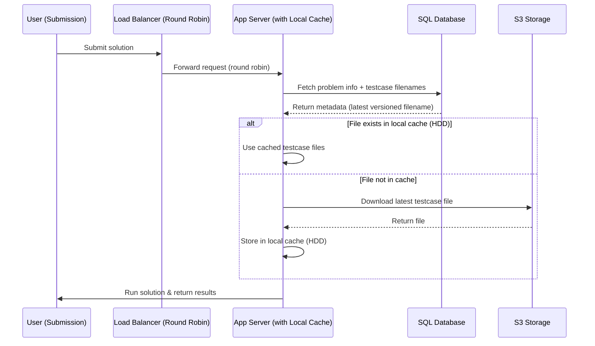
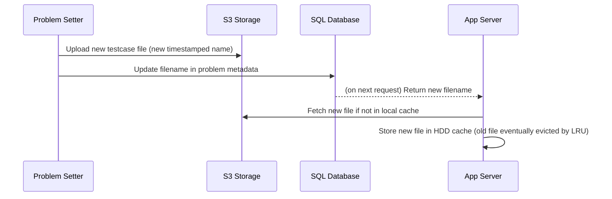

# 📌 Case Study: Cache Design for Scaler Code Judge

## 🚦 5-Step Process for Cache Design

1. **Establish the need for caching**

   * Data is too expensive or slow to fetch on every request → caching required.

2. **Determine the type of cache**

   * **Local vs Global**

     * Local → cache on each app server’s HDD.
     * Global → central/shared cache.
   * **Single vs Distributed** (only for global).

3. **Identify the invalidation algorithm**

   * Based on **consistency requirements**.
   * Based on **data/query complexity**.

4. **Identify the eviction algorithm**

   * Default: **LRU** (Least Recently Used).

5. **Think about the load balancer strategy**

   * **Consistent Hashing** (route request based on key → helps partition caches).
   * **Round Robin** (simple rotation → all servers see all problems).

---

## 📝 Scaler Code Judge Problem Context

1. **Testcase size is very large**

   * ~1 GB per problem.
   * ~100 problems solved per day.
   * Fetching from S3 for every request is **too expensive**.

2. **Cache Type**

   * Use **Local Cache** (on app server HDD).
   * Reason: Even if we use global cache, we’d still have to fetch across the network.
   * Single cache per app server.

3. **Invalidation Algorithm (Consistency Needs)**

   * **Requirement:** Immediate Consistency (for live contests).

     * If testcases are found to be wrong → must update immediately for submissions.
   * **Choice:** **Write-Through with explicit invalidation.**

   ❌ **Why not TTL?**

   * Low TTL → frequent reloads (5–6 GB downloads repeatedly).
   * High TTL → stale testcases, cannot achieve immediate consistency.

   ❌ **Why not Write-Around?**

   * Similar problem to TTL: depends on cron or fetch frequency → not immediate.

   ❌ **Why not Write-Back?**

   * Would require syncing across **1000 app servers** (local caches). Too heavy.

   ✅ **Chosen Approach:**

   * Versioned filenames for testcases:

     * `p1_input.txt` → `p1_input_2025-03-16_08:00.txt`.
   * SQL DB always stores **latest version’s filename**.
   * App server logic:

     1. On request → fetch problem meta + testcase filenames from SQL.
     2. If file exists on local HDD → use it.
     3. If not present → download from S3 → store → use.
   * **Problem setter handles invalidation**:

     * Upload new files to S3 (immutable).
     * Update filename in SQL.
     * After that, all app servers automatically switch to new files.

   👉 In short: **App servers only do eviction, not invalidation.**

4. **Eviction Algorithm**

   * **LRU (Least Recently Used)** applied locally on each app server.
   * Removes least accessed testcases when HDD is full.

5. **Load Balancer**

   * **Round Robin.**
   * Any request can go to any app server.
   * Each app server ends up caching the active set of ~100 problems.
   * Looks like duplication, but acceptable for simplicity + availability.

---

## 🔑 Key Insights

* **Immutability is the trick** → new version = new file, so no cache poisoning risk.
* **Invalidation is externalized** to problem setter (via SQL pointer).
* **App servers stay simple**: only need eviction, no complex invalidation logic.
* **Round Robin** is enough because every server eventually sees all problems.

---

👉 This is a clean, scalable design: **versioned immutable files + local cache + LRU eviction + round robin LB.**

---

# 📊 Flow Diagram: Cache for Scaler Code Judge

---

# 🛠 Invalidation Flow (Problem Setter Update)

---

# 🔑 Key Notes from Diagram

* **App servers don’t actively invalidate** → they just fetch the filename from SQL.
* **Problem setter does invalidation** by updating filename in SQL.
* **Immutability via versioned filenames** ensures no stale file overwrite issues.
* **LRU eviction** ensures HDD doesn’t fill up indefinitely.
* **Round Robin LB** keeps request routing simple — every server eventually caches hot files.

---

# 📌 Case Study: Scaler Contest Leaderboard (Caching Design)

---

## 1. Reason for Cache

### Working

* Contest duration: **3 hours**
* **100,000 participants**
* **5 problems**
* **Ranklist calculation**:

  * Compute final score for each user (based on submissions, incorrect attempts, time taken, etc.)
  * Final sorted list = ranklist

### Assumptions

* Avg submissions / participant / problem = **1**
* Total submissions = `1 × 5 × 100,000 = 500,000 submissions`
* Rate: `500,000 / 3 hrs ≈ 50 submissions/sec`
* Peak Load = `~100 submissions/sec`
* Submission size = 100 bytes → `500,000 × 100 = 50 MB total`
* Heavy computation: ~**5 sec** to compute ranklist from scratch

### Need for Caching

* Avg views per user = **20 times** during contest (~once every 10 mins)
* Total leaderboard views = `100,000 × 20 = 2,000,000 views`
* View rate = `~200 views/sec`
* Computing leaderboard per request is infeasible → **cache is mandatory**

---

## 2. Cache Type

### Local vs Global

* Ranklist page entry ≈ **1 KB per page** (`100 bytes × 10 entries`)
* Fetching ranklist = small data (per request)
* ✅ Use **Global Cache** (one shared cache for all users)

### Single vs Distributed

* Total ranklist data = `100 bytes × 100,000 users = 10 MB`
* Redis can easily store this and serve `200+ queries/sec`
* ✅ **Single Global Cache server** is enough

**Tech choice**:

* **Redis** (in-memory, key-value cache)
* Quick start:

  * Try online → [Redis Playground](https://onecompiler.com/redis)
  * Docs → [Redis Quick Start](https://redis.io/learn/howtos/quick-start)
  * [Redis Cheatsheet](https://redis.io/learn/howtos/quick-start/cheat-sheet)

---

## 3. Invalidation Algorithm

### Consistency

* **Strong consistency not required**
* Ranklist changes ~100 times/sec
* Recalculation takes ~5 sec (by then ranklist is already outdated)
* **Eventual Consistency is acceptable**

### Algorithm Options

* **TTL (Time-to-Live)**

  * Works best if DB fetch is easy but compute is heavy
  * ❌ Not ideal here (since computation is expensive each time)

* **Write-Around** (chosen approach)

  * Separate background service runs every **10 mins**
  * Service:

    1. Fetch all submissions
    2. Compute ranklist
    3. Store in Redis cache
  * Clients read from cache only
  * Optionally, **pre-warm cache** before contest starts (ranklist initialized with everyone tied at rank 1 or empty state)

---

## 4. Eviction Algorithm

* Total data per contest ≈ **20 MB**
* Redis can easily hold this → **no runtime eviction needed**
* Once contest ends → dump leaderboard into **SQL database** (permanent storage)

---

## 5. Load Balancer for Cache

* Single Redis instance can handle load (200 QPS ≪ Redis capacity ~100k QPS)
* ✅ **No load balancer needed**

---

## 🔑 Key Takeaways

* **Global + Single Redis cache** is sufficient.
* **Write-Around strategy** (periodic recomputation) ensures eventual consistency.
* No need for eviction → store results after contest ends.
* Pre-warming cache improves initial UX.

---
